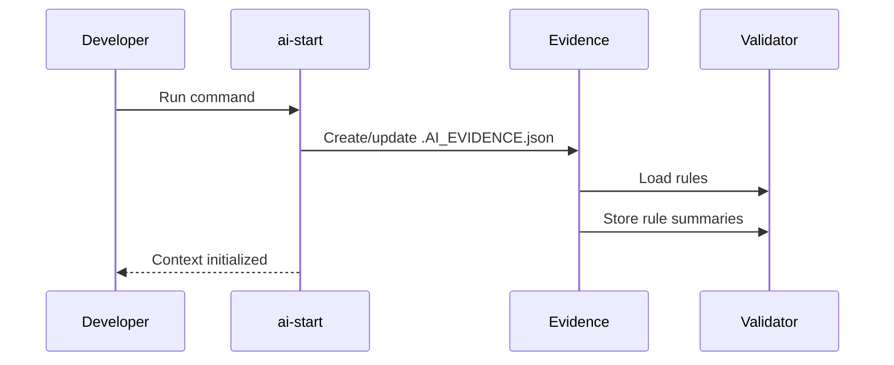
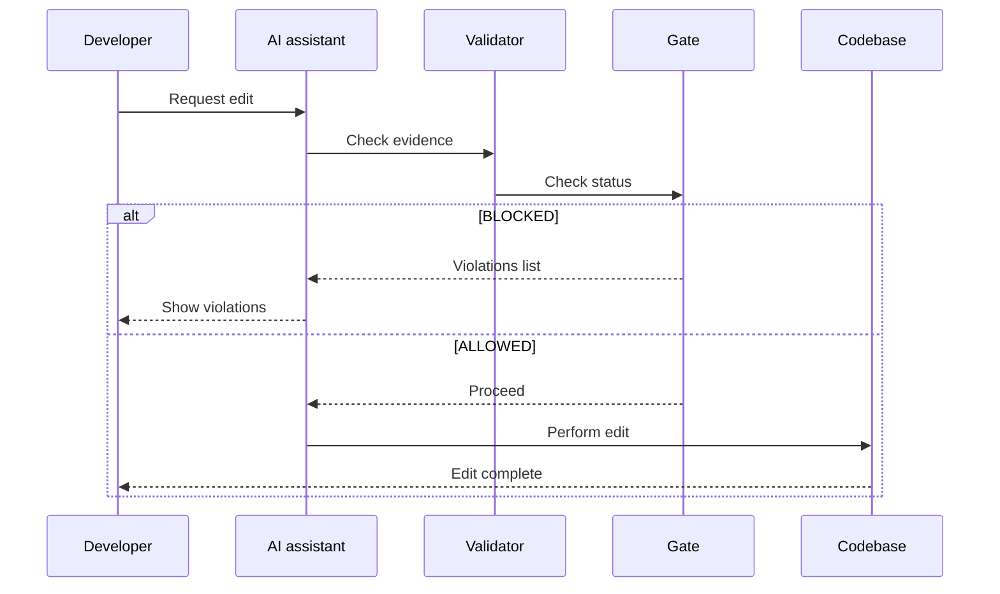
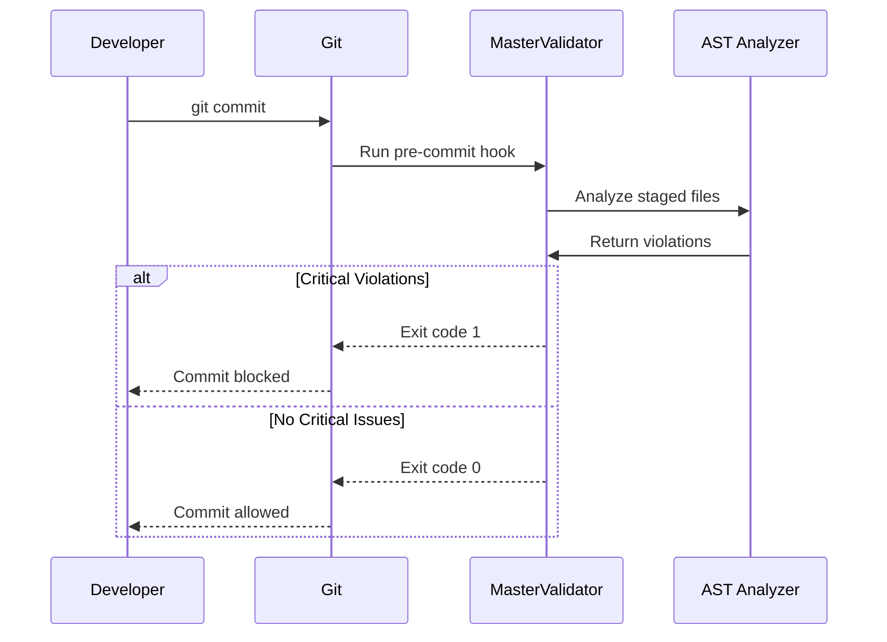

# AST Intelligence Hooks Architecture

## Overview
This document describes the architecture of the AST Intelligence Hooks library, which provides a comprehensive system for maintaining AI context and enforcing code quality across multiple platforms.

## Core Components

### 1. Evidence Management
- **`.AI_EVIDENCE.json`**: Central context file storing project state, rules, and violations.
- **`update-evidence.sh`**: Script to initialize/update evidence file.
- **`ai-start`**: Command to start evidence initialization.

### 2. Validation System
- **Pre-Tool-Use Validator**: Ensures evidence is fresh before AI actions.
- **AI Gate Check**: Blocks actions if critical violations exist.
- **Master Validator**: Enforces all rules during Git operations.

### 3. AST Intelligence Engine
- **Platform Analyzers**: iOS, Android, Backend, Frontend.
- **Rule Implementations**: Over 798 rules across platforms.
- **Violation Detection**: Scans code for architecture, security, and performance issues.

### 4. Git Integration
- **Git Hooks**: Pre-commit, pre-push hooks for automated checks.
- **Git Flow Enforcer**: Ensures branch naming and workflow compliance.

### 5. Event System
- **Event Listeners**: React to Git changes, branch switches, etc.
- **Realtime Monitoring**: Polls for evidence staleness and auto-refreshes.

## Workflow Sequence

### Initialization



### Code Editing


### Pre-Commit



## Examples
### Evidence File Example
```json
{
  "timestamp": "2025-12-13T23:07:19.632Z",
  "session_id": "feature/user-authentication",
  "protocol_3_questions": { /* ... */ },
  "rules_read": [ /* ... */ ],
  "current_context": { /* ... */ },
  "platforms": ["backend", "ios"],
  "ai_gate": { /* ... */ },
  "severity_metrics": { /* ... */ }
}
```

### Validator Output Example
```
❌ CRITICAL: AI Gate BLOCKED with 2 violations:
1. [backend.security.pii_in_logs] Potential PII in logs (file: user.service.ts, line: 45)
2. [ios.force_unwrapping] Force unwrapping detected (file: UserViewController.swift, line: 78)
