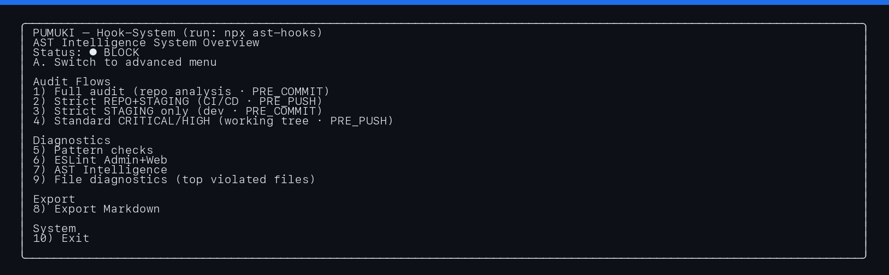
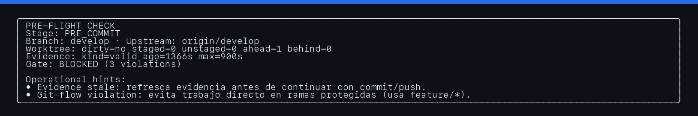
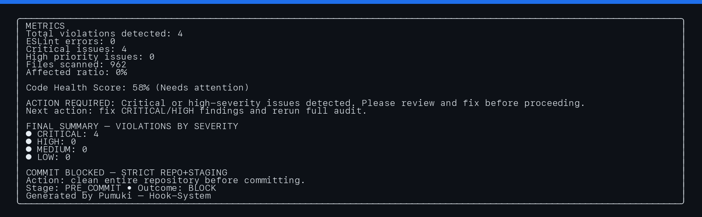
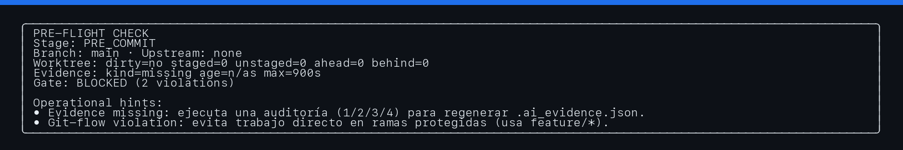
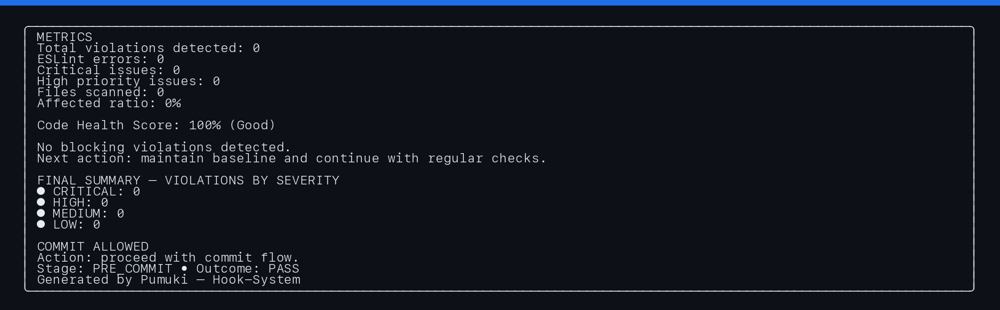

# Pumuki


[](https://www.npmjs.com/package/pumuki)
[](https://github.com/SwiftEnProfundidad/ast-intelligence-hooks/actions/workflows/ci.yml)
[](LICENSE)

Enterprise governance framework for AI-assisted software delivery.

Pumuki gives engineering teams one deterministic execution model across local development, hooks, and CI:

`Facts -> Rules -> Gate -> .ai_evidence.json (v2.1)`

## Who This README Is For

| Profile | Use this path first |
|---|---|
| Consumer repository team | [5-Minute Quick Start (Consumer)](#5-minute-quick-start-consumer) |
| Framework maintainers (this repo) | [Framework Maintainer Flow](#framework-maintainer-flow-this-repo) |
| Platform/architecture owners | [Enterprise Operations Baseline](#enterprise-operations-baseline) |

## 5-Minute Quick Start (Consumer)

Prerequisites:

- Node.js `>= 18`
- npm `>= 9`
- Git repository

Install and bootstrap:

```bash
npm install --save-exact pumuki
npx --yes pumuki install
npx --yes pumuki doctor
npx --yes pumuki status
```

OpenSpec/SDD baseline:

```bash
npx --yes pumuki sdd status
mkdir -p openspec/changes/<change-id>
npx --yes pumuki sdd session --open --change=<change-id>
npx --yes pumuki sdd validate --stage=PRE_COMMIT
```

Run local gates:

```bash
npx --yes pumuki-pre-write
npx --yes pumuki-pre-commit
```

Run push/CI gates (requires proper git context):

```bash
git push --set-upstream origin <branch>
npx --yes pumuki-pre-push
npx --yes pumuki-ci
```

Expected behavior:

- `PRE_WRITE` and `PRE_COMMIT`: should pass when SDD session is valid and rules are satisfied.
- `PRE_PUSH`: blocks if branch has no upstream tracking reference.
- `CI`: requires a valid diff range context (not `HEAD..HEAD` with ambiguous range).

## Why Pumuki

Modern teams need fast feedback with strict governance. Pumuki combines:

- Deterministic enforcement per stage (`PRE_WRITE`, `PRE_COMMIT`, `PRE_PUSH`, `CI`).
- A single evidence contract (`.ai_evidence.json`, v2.1) for auditability and automation.
- Multi-platform governance (iOS, Android, Backend, Frontend).
- Unified skills engine with deterministic precedence (`core -> repo -> custom`).
- Mandatory OpenSpec/SDD checks for enterprise change control.
- Unified CLI plus optional MCP servers for agent-driven workflows.

## Enterprise Execution Model

Each execution follows the same pipeline:

1. Facts extraction from staged/range/repo scope.
2. Rule evaluation by platform and stage policy.
3. Gate decision (`PASS`, `WARN`, `BLOCK`) with deterministic thresholds.
4. Evidence emission (`.ai_evidence.json`) with findings, metadata, and coverage telemetry.

Rules resolution order:

1. Core rules (embedded package snapshot).
2. Repo rules (`skills.lock.json`), optional.
3. Custom rules (`.pumuki/custom-rules.json`), optional.

Conflict policy:

- `custom > repo > core` (last writer wins by `ruleId`).
- Platform rules activate only for detected platforms.
- `generic/text` rules remain available as cross-platform governance guards.

Rule modes:

- `AUTO`: mapped to deterministic detectors/heuristics.
- `DECLARATIVE`: valid only when explicitly declared in lock/custom payload (no silent fallback for rules extracted from skills markdown).

## Core Capabilities

1. Deterministic stage gates with consistent exit semantics.
2. Evidence v2.1 with rules coverage enforcement and stable ordering.
3. Unified skills rules engine (core + repo + custom).
4. Unified AI gate behavior across CLI and MCP surfaces.
5. Mandatory OpenSpec/SDD policy checks.
6. Interactive menu UX (consumer + advanced modes).
7. Hard mode policy hardening (`.pumuki/hard-mode.json` + env overrides).
8. Lifecycle commands for install/update/diagnostics/teardown.
9. Provider-agnostic adapter scaffolding (`codex`, `claude`, `cursor`, `windsurf`, `opencode`).
10. Optional MCP servers for evidence and enterprise context.

## Framework Maintainer Flow (This Repo)

Use this only when working in the Pumuki framework repository itself:

```bash
npm run framework:menu
PUMUKI_MENU_UI_V2=1 npm run framework:menu
PUMUKI_MENU_MODE=advanced npm run framework:menu
```

Skills engine operations:

```bash
npm run skills:compile
npm run skills:lock:check
npm run skills:import:custom
npm run skills:import:custom -- --source <absolute-path-to-SKILL.md> --source <second-absolute-path-to-SKILL.md>
```

Adapter scaffolding:

```bash
npx --yes pumuki adapter install --agent=codex --dry-run
npx --yes pumuki adapter install --agent=cursor
npm run adapter:install -- --agent=claude
```

Operational matrix/canary:

```bash
node --import tsx -e "const mod = await import('./scripts/framework-menu-matrix-runner-lib.ts'); const report = await mod.default.runConsumerMenuMatrix({ repoRoot: process.cwd() }); console.log(JSON.stringify(report, null, 2));"
node --import tsx -e "const mod = await import('./scripts/framework-menu-matrix-canary-lib.ts'); const report = await mod.default.runConsumerMenuCanary({ repoRoot: process.cwd() }); console.log(JSON.stringify(report, null, 2));"
```

Legacy parity report (strict comparator):

```bash
node --import tsx scripts/build-legacy-parity-report.ts --legacy=<legacy-evidence-path> --enterprise=<enterprise-evidence-path> --out=<output-path>
```

## Command Reference

### Lifecycle (Consumer)

```bash
npx --yes pumuki install
npx --yes pumuki update --latest
npx --yes pumuki uninstall --purge-artifacts
npx --yes pumuki remove
npx --yes pumuki doctor
npx --yes pumuki status
```

### SDD / OpenSpec (Consumer)

```bash
npx --yes pumuki sdd status
npx --yes pumuki sdd session --open --change=<change-id>
npx --yes pumuki sdd session --refresh
npx --yes pumuki sdd session --close
npx --yes pumuki sdd validate --stage=PRE_COMMIT
```

### Stage Gates (Consumer)

```bash
npx --yes pumuki-pre-write
npx --yes pumuki-pre-commit
npx --yes pumuki-pre-push
npx --yes pumuki-ci
```

### MCP Servers (Optional, Long-Running)

```bash
npx --yes pumuki-mcp-evidence
npx --yes pumuki-mcp-enterprise
```

## Validation and Diagnostics (Framework-Only)

These commands are for maintainers and may require additional arguments, external repo context, or authenticated GitHub access.

```bash
npm run validation:consumer-ci-artifacts -- --repo <owner/repo>
npm run validation:consumer-ci-auth-check -- --repo <owner/repo>
npm run validation:consumer-workflow-lint -- --repo-path <absolute-path-to-consumer-repo>
npm run validation:consumer-support-bundle -- --repo <owner/repo>
npm run validation:consumer-support-ticket-draft
npm run validation:consumer-startup-unblock-status
npm run validation:consumer-startup-triage -- --repo <owner/repo> --skip-workflow-lint
npm run validation:mock-consumer-ab-report
npm run validation:adapter-readiness
npm run validation:adapter-session-status
npm run validation:adapter-real-session-report
npm run validation:phase5-blockers-readiness
npm run validation:phase5-execution-closure-status
npm run validation:phase5-execution-closure -- --repo <owner/repo> --skip-workflow-lint
npm run validation:phase5-external-handoff
npm run validation:clean-artifacts
```

Important:

- Several validation scripts intentionally return non-zero when verdict is `BLOCKED`, `PENDING`, or `MISSING_INPUTS`.
- Non-zero in these scripts is often diagnostic output, not a runtime crash.
- `validation:consumer-support-ticket-draft` expects an existing support bundle generated by `validation:consumer-support-bundle`.
- If workflow lint is required in your flow, provide `--repo-path` and `--actionlint-bin`; otherwise use `--skip-workflow-lint`.

## Menu Walkthrough and Screenshots

### Capture 1 — Consumer Menu (v2)



### Capture 2 — Option 1 Pre-flight (BLOCK context)



### Capture 3 — Option 1 Final Summary (BLOCK)



### Capture 4 — Option 1 Pre-flight (PASS scenario)



### Capture 5 — Option 1 Final Summary (PASS)



### Capture 6 — Menu Status After PASS Run


Extended annotated walkthrough:

- `docs/README_MENU_WALKTHROUGH.md`

## Enterprise Operations Baseline

Pumuki production SaaS operation baseline is defined in:

- `docs/OPERATIONS.md`

Highlights:

- Minimum SLO/SLA targets for ingestion availability, latency, freshness, and isolation.
- Severity model (`SEV1/SEV2/SEV3`) with response and RCA expectations.
- Mandatory controls for tenant/repo isolation, auth policy, idempotency, and auditing.
- Go-live checklist and rollback requirements.

## Troubleshooting

- `OpenSpec change "<id>" not found`: ensure `openspec/changes/<id>` exists before opening session.
- `SDD_SESSION_MISSING`: open and validate session first.
- `pre-push blocked: branch has no upstream`: run `git push --set-upstream origin <branch>`.
- `Missing required argument --repo` / `--repo-path`: pass required flags for validation scripts.
- Legacy parity report usage requires `--legacy=<path>` and `--enterprise=<path>` (equals form).
- If menu v2 rendering fails, Pumuki falls back to classic UI.

## Documentation Index

- Installation: `docs/INSTALLATION.md`
- Usage: `docs/USAGE.md`
- Testing: `docs/TESTING.md`
- API reference: `docs/API_REFERENCE.md`
- Architecture: `docs/ARCHITECTURE.md`
- Configuration: `docs/CONFIGURATION.md`
- Code standards: `docs/CODE_STANDARDS.md`
- Branch protection: `docs/BRANCH_PROTECTION_GUIDE.md`
- MCP servers: `docs/MCP_SERVERS.md`
- MCP evidence server: `docs/MCP_EVIDENCE_CONTEXT_SERVER.md`
- MCP consumption: `docs/MCP_AGENT_CONTEXT_CONSUMPTION.md`
- Evidence schema v2.1: `docs/evidence-v2.1.md`
- Operations policy (SLA/SLO): `docs/OPERATIONS.md`
- Release notes: `docs/RELEASE_NOTES.md`
- Changelog: `CHANGELOG.md`

## Collaboration

Contributions are welcome. For high-quality collaboration:

1. Read `docs/CONTRIBUTING.md` and `docs/CODE_STANDARDS.md`.
2. Create a dedicated branch per change.
3. Keep scope focused and include deterministic evidence when relevant.
4. Before opening a PR, run at least:
   - `npm run typecheck`
   - `npm run test:operational-memory`
   - `npm run test:saas-ingestion`
5. Open a PR with clear problem statement, approach, and validation evidence.

## Support and Security

- Functional/usage issues: open a GitHub issue with reproducible steps.
- Enterprise diagnostics: include generated reports from `.audit-reports` when applicable.
- Security-sensitive findings: use GitHub Security Advisories for coordinated disclosure.

## License

MIT. See `LICENSE`.

## If Pumuki Helped You

If this project was useful for your team, please consider leaving a GitHub star:

[Star Pumuki on GitHub](https://github.com/SwiftEnProfundidad/ast-intelligence-hooks)
