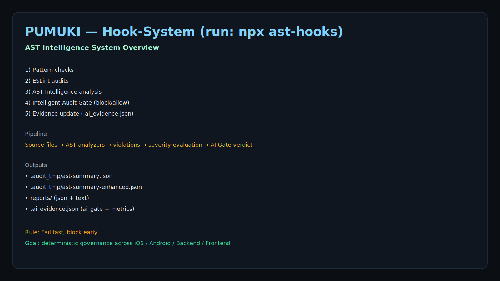
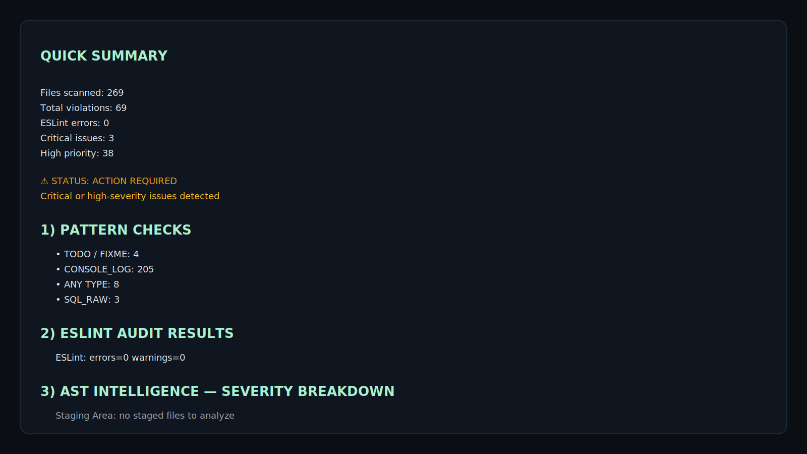

<p align="center">
  
</p>

<h1 align="center">@pumuki/ast-intelligence-hooks</h1>

<p align="center">
  <a href="https://www.npmjs.com/package/pumuki-ast-hooks"></a>
  <a href="https://www.npmjs.com/package/pumuki-ast-hooks"></a>
  <a href="https://github.com/SwiftEnProfundidad/ast-intelligence-hooks/blob/main/LICENSE"></a>
  <a href="https://nodejs.org/"></a>
  <a href="https://www.npmjs.com/"></a>
  
  <a href="https://github.com/SwiftEnProfundidad/ast-intelligence-hooks/releases"></a>
  <a href="https://github.com/SwiftEnProfundidad/ast-intelligence-hooks/issues"></a>
</p>

<p align="center">
  <strong>Enterprise-grade AST Intelligence System for multi-platform code quality enforcement</strong>
</p>

### Navigation

| Section | Description |
|---------|-------------|
| [Quick Start](#quick-start) | Get started in 30 seconds |
| [Features](#features) | Main capabilities |
| [Installation](./docs/INSTALLATION.md) | Full installation guide |
| [Architecture](./docs/ARCHITECTURE.md) | System design & contracts |
| [API Reference](./docs/API_REFERENCE.md) | Programmatic interface |
| [Roadmap](./docs/TODO.md) | Planned improvements |
| [Changelog](./CHANGELOG.md) | Version history |
| [Contributing](./docs/CONTRIBUTING.md) | How to contribute |

# Pumuki AST Intelligence Framework

## Enterprise AI Context Governance & Code Quality Enforcement

Pumuki AST Intelligence Framework is a **portable, enterprise-grade framework** designed to **govern AI-assisted software development** in large, long-lived, multi-platform projects.

It provides a **deterministic control layer** over AI behavior by combining:

* AST-based static analysis
* Persistent AI context evidence
* Rule-based validation
* Hard AI gating (block / allow)
* Native Git workflow integration

The framework is **project-agnostic** by design and can be adopted by any organization seeking to use AI **safely, predictably, and at scale**.

---

## Problem Statement

AI assistants are powerful but fundamentally unreliable when used in real-world, enterprise codebases:

* Context degrades across sessions, chats, and tools
* Architectural rules are suggested but not enforced
* AI hallucinations introduce subtle, high-impact defects
* There is no persistent or auditable source of truth
* Long-running features suffer from context drift

Pumuki addresses these issues by **removing trust from the AI** and replacing it with **evidence, validation, and enforcement**.

---

## Quick Start

1. Instala dependencias: `npm install`
2. Usa los ganchos: `npx ast-hooks` (menú interactivo)
3. Modo CI/CD: `bash scripts/hooks-system/infrastructure/shell/orchestrators/audit-orchestrator.sh`
4. Consulta la guía: [docs/INSTALLATION.md](./docs/INSTALLATION.md)

---

## Installation & Hooks CLI

* Install (dev): `npm install --save-dev @pumuki/ast-intelligence-hooks`
* Update to latest: `npm install --save-dev @pumuki/ast-intelligence-hooks@latest && npm run install-hooks`
* Uninstall: `npm uninstall @pumuki/ast-intelligence-hooks`
* Install/reinstall hooks: `npm run install-hooks` (alias `npx ast-install`)
* Interactive menu (hook-system): `npx ast-hooks`
* Evidence guard daemon: `npm run ast:guard:start|stop|restart|status|logs`
* Refresh evidence: `npm run ast:refresh`
* Check installed vs latest version: `npm run ast:check-version`

---

## Features

* AST intelligence multi-plataforma (iOS, Android, Backend, Frontend)
* Evidence file `.AI_EVIDENCE.json` como fuente de verdad
* AI Gate (block/allow) con métricas
* Git-native (pre-commit / pre-push / CI)
* Notificaciones macOS + guardrails de árbol Git
* Automatización Git Flow (`ast:gitflow`, `ast:release`)

---

## Visual Overview






---

## Design Philosophy

Pumuki is built on a few non-negotiable principles:

* **Evidence over conversation**
  AI does not rely on chat memory. All decisions depend on a persistent evidence file.

* **Gated intelligence**
  AI actions are explicitly allowed or blocked based on project state.

* **AST, not heuristics**
  Code is analyzed structurally, not via regex or conventions.

* **Fail fast, block early**
  Unsafe or invalid AI actions are prevented before code changes occur.

* **Platform-agnostic governance**
  The same rules apply consistently across iOS, Android, backend, and frontend.

---

## Core Capabilities

### 1. AI Evidence System

Pumuki introduces a mandatory, versioned **AI Evidence File** (`.AI_EVIDENCE.json`) that acts as the **single source of truth** for AI-assisted development.

It stores:

* Active platforms and scopes
* Architectural and quality rules
* Detected violations and severities
* Session and workflow metadata
* AI gate state

The AI **cannot operate** without valid and fresh evidence.

---

### 2. AI Gate (Control Primitive)

The AI Gate is the core control mechanism of the framework.

Before any AI-assisted operation:

* Evidence freshness is validated

* Violations are evaluated

* A deterministic decision is made:

* **ALLOWED** → operation may proceed

* **BLOCKED** → operation is rejected with actionable feedback

This transforms AI from an advisory tool into a **controlled execution actor**.

---

### 3. AST Intelligence Engine

The AST Intelligence Engine performs deep, language-aware analysis across platforms.

Capabilities include:

* Architectural rule enforcement
* Security and data safety validation
* Performance anti-pattern detection
* Detection of forbidden constructs and flows

The engine operates on **real ASTs**, not text approximations.

---

### 4. Git-Native Enforcement

Pumuki integrates directly with Git workflows:

* Pre-commit hooks
* Pre-push hooks
* Branch and flow validation

Violations can:

* Block commits
* Block pushes
* Prevent unsafe changes from reaching CI/CD

Governance happens **before** code reaches production.

---

## Supported Platforms

Pumuki is multi-platform by default:

* iOS (Swift)
* Android (Kotlin)
* Backend (Node.js / NestJS)
* Frontend (React / Next.js)

The framework is extensible to additional platforms and languages.

---

## AI IDE Compatibility (Pre-Write Enforcement)

Pumuki supports **real-time code blocking** in IDEs with pre-write hooks:

| IDE | Hook Support | Blocks Before Write? | Fallback |
|-----|--------------|---------------------|----------|
| **Windsurf** | `pre_write_code` | ✅ YES | Git pre-commit |
| **Claude Code** | `PreToolUse` (Write/Edit) | ✅ YES | Git pre-commit |
| **OpenCode** | Plugin `tool.execute.before` | ✅ YES | Git pre-commit |
| **Codex CLI** | Approval policies only | ⚠️ Manual | Git pre-commit |
| **Cursor** | `afterFileEdit` only | ⚠️ Post-write | Git pre-commit |
| **Kilo Code** | Not documented | ⚠️ No | Git pre-commit |

### How It Works

```
AI generates code → IDE Hook intercepts → AST Intelligence analyzes → 
  ├─ Critical violations? → ❌ BLOCKED (code not written)
  └─ No violations? → ✅ ALLOWED (code written)
```

### Enforcement Layers

1. **IDE Hooks** (Windsurf, Claude Code, OpenCode): Block BEFORE code is written
2. **Git Pre-Commit**: Block commits with violations (100% fallback for all IDEs)
3. **MCP Gate**: AI cannot proceed without passing `ai_gate_check`

> **Note**: For IDEs without pre-write hooks, the Git pre-commit hook provides 100% enforcement at commit time.

See [`scripts/hooks-system/infrastructure/cascade-hooks/README.md`](./scripts/hooks-system/infrastructure/cascade-hooks/README.md) for installation instructions.

---

## Typical Enterprise Use Cases

* Long-running feature development with AI assistance
* Multi-day or multi-chat workflows
* Large monorepos and distributed teams
* Strict Clean Architecture enforcement
* Regulated or compliance-sensitive environments

---

## Installation

**Requirements**

* Node.js 20 (see `.nvmrc`)
* npm 10+

Install as a development dependency:

```bash
npm install --save-dev @pumuki/ast-intelligence-hooks
```

Legacy (deprecated):

```bash
npm install --save-dev pumuki-ast-hooks
```

Initialize AI evidence:

```bash
npx ai-start
```

---

## Installation & Lifecycle Commands

### Update to latest version

```bash
npm install --save-dev @pumuki/ast-intelligence-hooks@latest
npm run install-hooks
````

### Uninstall

```bash
npm uninstall @pumuki/ast-intelligence-hooks
```

Legacy:

```bash
npm uninstall pumuki-ast-hooks
```

---

## Hook Installation & Management

Install or update Git hooks (wizard-driven):

```bash
npm run install-hooks
```

(Equivalent to `npx ast-install`)

---

## Operational Commands

### Check installed version vs. latest published

```bash
npm run ast:check-version
```

### Run hook system with interactive menu

```bash
npx ast-hooks
```

---

## Manual Hook-System (Interactive Menu)

Pumuki can be used fully manually (without waiting for Git hooks) via the interactive audit menu.

### Recommended

```bash
npx ast-hooks
```

### Direct CLI (explicit)

```bash
ast-hooks audit
```

### Run the orchestrator directly (local repository)

```bash
bash scripts/hooks-system/infrastructure/shell/orchestrators/audit-orchestrator.sh
```

### Non-interactive mode

You can run specific audit modes without the menu:

```bash
# Example: run AST Intelligence directly
AUDIT_OPTION=7 bash scripts/hooks-system/infrastructure/shell/orchestrators/audit-orchestrator.sh

# Example: analyze staged files only (pre-commit equivalent)
AUDIT_OPTION=3 bash scripts/hooks-system/infrastructure/shell/orchestrators/audit-orchestrator.sh
```

If defined as scripts:

```bash
npm run ast:gitflow   # guided Git flow
npm run ast:release   # guided release flow (develop → main)
npm run ast:audit     # direct audit
```

---

## Git Governance & Flow Automation

Pumuki includes first-class Git governance commands to enforce a consistent workflow across teams and repositories.

### Daily Development Flow

```bash
npm run ast:gitflow
```

With optional auto-merge:

```bash
npm run ast:gitflow -- --auto-merge
```

### Release Flow (develop → main)

```bash
npm run ast:release
```

With optional auto-merge:

```bash
npm run ast:release -- --auto-merge
```

### Git Flow Cycle (ast:gitflow)

Pumuki runs a complete Git Flow cycle:

* Step 1: Validate Branch (must be feature/, fix/, etc.)
* Step 2: Commit Changes (if uncommitted)
* Step 3: Push to Origin
* Step 4: Create Pull Request
* Step 5: Merge Pull Request (optional)
* Step 6: Cleanup Merged Branches
* Step 7: Sync Branches
* Git Flow Cycle Complete

### Options

```bash
npm run ast:gitflow
npm run ast:gitflow -- -m "feat: new feature"
npm run ast:gitflow -- --auto-merge
npm run ast:gitflow -- --skip-cleanup
npm run ast:gitflow -- --skip-sync
```

---

## Evidence Guard (Daemon)

The evidence guard ensures AI evidence freshness during long work sessions.

```bash
npm run ast:guard:start
npm run ast:guard:stop
npm run ast:guard:restart
npm run ast:guard:status
npm run ast:guard:logs
```

---

## Developer Experience: Notifications & Guardrails

Pumuki includes a built-in notification and guardrail layer to keep long work sessions safe and predictable.

### macOS Notifications

On macOS, notifications are delivered using:

* `terminal-notifier` (preferred, if installed)
* `osascript` fallback (built-in)

The notification system includes deduplication, cooldowns, and retry logic to avoid spam during long sessions.

### Evidence Freshness Alerts (SLA)

When `.AI_EVIDENCE.json` becomes stale beyond the configured threshold, the guard will:

* Notify that evidence is stale (including how many seconds)
* Optionally attempt an auto-refresh depending on guard configuration

When evidence returns to a fresh state (back within SLA), the guard can notify that evidence is healthy again.

### AI Evidence Refresh Notifications

When evidence is refreshed, the orchestration layer updates `.AI_EVIDENCE.json` and sends a macOS notification:

* If gate is **ALLOWED**: `AI Evidence has been refreshed automatically`
* If gate is **BLOCKED**: `AI Gate BLOCKED - <N> violations need fixing`

### Git Tree Guardrails (Atomic Commits)

Pumuki monitors the working tree and staging area and can notify when there are too many changes at once.

Typical behavior:

* Warn/error when the git tree exceeds configured limits (total/staged/unstaged)
* Suggest splitting work into smaller, atomic commits
* Provide grouped commit suggestions when it can infer feature-based groupings

Configuration (environment variables):

* `HOOK_GUARD_DIRTY_TREE_STAGED_LIMIT` (default: 10)
* `HOOK_GUARD_DIRTY_TREE_UNSTAGED_LIMIT` (default: 15)
* `HOOK_GUARD_DIRTY_TREE_TOTAL_LIMIT` (default: 20)
* `HOOK_GUARD_DIRTY_TREE_INTERVAL` (default: 60000 ms)
* `HOOK_GUARD_DIRTY_TREE_REMINDER` (default: 300000 ms)

### Failure Modes (Visibility)

If the framework cannot read or parse `.AI_EVIDENCE.json`, evidence reads will safely fail (returning `null`) and the guard will record debug entries to help diagnose the issue.

---

## Evidence Maintenance

Manually refresh AI evidence:

```bash
npm run ast:refresh
```

---

## Daily Workflow (High Level)

## Maturity & Stability

* Production usage
* CI/CD integration
* Changelog-driven evolution
* Designed for long-lived codebases

Frequent updates are expected and encouraged at this stage.

---

## Intended Audience

Pumuki is intentionally opinionated and designed for:

* Senior engineers
* Tech leads
* Software architects
* Platform and infrastructure teams

It is not optimized for casual or experimental AI usage.

---

## License

© Pumuki 2025. All rights reserved.
