<p align="center">
  
</p>

<h1 align="center">@pumuki/ast-intelligence-hooks</h1>

<p align="center">
  <a href="https://www.npmjs.com/package/pumuki-ast-hooks"></a>
  <a href="https://www.npmjs.com/package/pumuki-ast-hooks"></a>
  <a href="https://github.com/SwiftEnProfundidad/ast-intelligence-hooks/blob/main/LICENSE"></a>
  <a href="https://nodejs.org/"></a>
  <a href="https://www.npmjs.com/"></a>
  
  <a href="https://github.com/SwiftEnProfundidad/ast-intelligence-hooks/releases"></a>
  <a href="https://github.com/SwiftEnProfundidad/ast-intelligence-hooks/issues"></a>
</p>

<p align="center">
  <strong>Enterprise-grade AST Intelligence System for multi-platform code quality enforcement</strong>
</p>

<p align="center">
  <a href="#-quick-start">Quick Start</a> •
  <a href="#-features">Features</a> •
  <a href="./docs/INSTALLATION.md">Installation</a> •
  <a href="./docs/API_REFERENCE.md">API Reference</a> •
  <a href="./CHANGELOG.md">Changelog</a> •
  <a href="./docs/CONTRIBUTING.md">Contributing</a>
</p>

### Visual Overview


---

## 🧠 The Vision: Solving AI Context Loss in Software Development

### The Fundamental Problem

In modern AI-assisted development, a critical limitation emerges: **AI assistants lose context**. Whether due to token limits, session resets, or conversation boundaries, AI agents repeatedly forget:

- **Project architecture**: "What's the structure here? Clean Architecture? DDD? Feature-First?"
- **Active rules**: "Which validation rules apply? What are the coding standards?"
- **Current work**: "What branch am I on? What files were recently changed? What patterns exist?"
- **Quality gates**: "Are there blocking violations? What needs to be fixed?"

This forces developers into a **repetitive, inefficient cycle** of re-explaining context, re-loading rules, and re-establishing project understanding—defeating the purpose of AI assistance.

### The Solution: Permanent Context Persistence

This library was conceived to solve this fundamental problem by creating a **permanent, always-on context system** for AI assistants. It transforms AI from a "stateless helper" into a **context-aware collaborator** that maintains deep, persistent understanding of your project.

---

## 🔄 How It Works: The Complete Flow

### Phase 1: Context Initialization (`ai_start` Protocol)

**When**: Before any code editing begins, or when context becomes stale (>3 minutes)

**What Happens**:

1. **Developer runs `ai-start`** (or it auto-executes via MCP):
   ```bash
   ai-start feature/user-authentication
   # or automatically via MCP: auto_execute_ai_start
   ```

2. **The system answers three critical questions**:
   - **Q1: What file types am I working with?**
     - Analyzes staged/modified files
     - Detects platforms (iOS, Android, Backend, Frontend)
     - Identifies target Clean Architecture layers (Domain, Application, Infrastructure, Presentation)
     - Example: `"Code task on branch 'feature/auth'. Modifying typescript, kotlin in: auth, users. Target layer: Domain."`
   
   - **Q2: Does similar code already exist?**
     - Analyzes recent Git commits
     - Identifies affected modules
     - Suggests existing patterns to follow
     - Example: `"Modules affected: auth, users. Recent commits: abc123 feat: Add JWT validation. Check for existing patterns before adding new code."`
   
   - **Q3: How does this fit in Clean Architecture?**
     - Validates layer dependencies
     - Ensures dependencies point inward (Domain ← Application ← Infrastructure)
     - Example: `"Code changes in Domain layer affecting auth, users. Ensure dependencies point inward."`

3. **Rules are automatically loaded**:
   - `DynamicRulesLoader` scans agentic IDE rules directories (`.cursor/rules/`, `.ast-intelligence/skills/`, `.windsurf/rules/`, `.vscode/rules/`, `.kilo/rules/`, `.cline/rules/`) for platform-specific rules
   - **Always loads `rulesgold.mdc` first** (generic rules that apply to all projects)
   - Then loads platform-specific rules: `rulesbackend.mdc`, `rulesios.mdc`, `rulesandroid.mdc`, `rulesfront.mdc`
   - Aggregates all 798+ validation rules into a single context
   - Creates `auto-context.mdc` with all active rules

4. **`.AI_EVIDENCE.json` is created/updated**:
   ```json
   {
     "timestamp": "2025-12-13T23:07:19.632Z",
     "session_id": "feature/user-authentication",
     "protocol_3_questions": {
       "answered": true,
       "question_1_file_type": "Code task on branch 'feature/auth'. Modifying typescript, kotlin in: auth, users. Target layer: Domain.",
       "question_2_similar_exists": "Modules affected: auth, users. Recent commits: abc123 feat: Add JWT validation. Check for existing patterns before adding new code.",
       "question_3_clean_architecture": "Code changes in Domain layer affecting auth, users. Ensure dependencies point inward."
     },
     "rules_read": [
       { "file": "rulesgold.mdc", "verified": true, "summary": "IDE Rules: ### ANTES de implementar CUALQUIER cosa (aplicables en todas las tecnologías):;### Reglas de Arquitectura:;### Seguridad y Validación:;### Performance y Escalabilidad:;### Testing y Calidad:;### Observabilidad y Debugging:;### Arquitectura y Diseño:;### Control de Versiones y Colaboración:;### i18n y Accesibilidad:;### Error Handling:; | AST: Files: 96, Rules: types.any,debug.console,security.secret,security.sql.raw,performance.pagination,performance.nplus1,architecture.layering,ios.force_unwrapping" },
       { "file": "rulesbackend.mdc", "verified": true, "summary": "IDE Rules: ### NestJS Architecture:;### Repository Pattern:;### Use Cases Pattern:;### DTOs y Validación:;### Database y ORM:;### Autenticación y Autorización:;### Event-Driven Architecture:;### Caché (Redis):;### Logging y Observabilidad:;### Testing Backend:;### Error Handling:;### Seguridad:;### Performance:;### API Design:;### Configuración:;### Documentación:; | AST: Files: 16, Rules: backend.error_handling.untyped_catch,backend.security.pii_in_logs,backend.performance.nplus1" },
       { "file": "rulesios.mdc", "verified": true, "summary": "IDE Rules: ### Swift Moderno:;### SwiftUI (Preferido):;### UIKit (Legacy/Necesario):;### Protocol-Oriented Programming:;### Value Types:;### Memory Management:;### Optionals:;### Clean Architecture en iOS:;### Dependency Injection:;### Networking:;### Persistence:;### Combine (Reactive):;### Concurrency:;### Testing:;### Security:;### Accessibility:;### Localization:; | AST: Files: 24, Rules: ios.force_unwrapping,ios.singleton,ios.massive_view_controller" }
     ],
     "current_context": {
       "branch": "feature/user-authentication",
       "last_commits": "abc123 feat: Add JWT validation"
     },
     "platforms": ["backend", "ios"],
     "ai_gate": {
       "status": "BLOCKED",
       "last_check": "2025-12-13T23:16:39.736Z",
       "violations": [
         {
           "file": "/path/to/project/src/auth/user.service.ts",
           "line": 45,
           "severity": "HIGH",
           "rule": "backend.error_handling.untyped_catch",
           "message": "Catch parameter MUST be typed as ': unknown' - use type guards (error instanceof HttpException/Error)",
           "category": "Error Handling",
           "intelligent_evaluation": false,
           "severity_score": 50
         },
         {
           "file": "/path/to/project/src/auth/auth.controller.ts",
           "line": 12,
           "severity": "CRITICAL",
           "rule": "backend.security.pii_in_logs",
           "message": "🚨 CRITICAL: Potential PII in logs. Never log: passwords, tokens, SSN, credit cards. Sanitize: logger.info({ userId, action }) - don't include sensitive fields. GDPR violation risk.",
           "category": "Security",
           "intelligent_evaluation": true,
           "severity_score": 100
         }
       ],
       "instruction": "🚨 AI MUST call mcp_ast-intelligence-automation_ai_gate_check BEFORE any action. If BLOCKED, fix violations first!",
       "mandatory": true
     },
     "severity_metrics": {
       "last_updated": "2025-12-13T23:16:39.726Z",
       "total_violations": 2,
       "by_severity": {
         "CRITICAL": 1,
         "HIGH": 1,
         "MEDIUM": 0,
         "LOW": 0
       },
       "average_severity_score": 75,
       "gate_status": "FAILED",
       "blocked_by": "CRITICAL"
     }
   }
   ```

### Phase 2: Continuous Context Maintenance

**When**: Throughout the development session

**What Happens**:

1. **Pre-Tool-Use Validation** (`pre-tool-use-evidence-validator.ts`):
   - **Before every AI edit operation**, validates `.AI_EVIDENCE.json`:
     - ✅ File exists
     - ✅ Valid JSON structure
     - ✅ Timestamp is fresh (<180 seconds old)
     - ✅ Rules were read
     - ✅ Protocol 3 questions answered
     - ✅ AI gate is not BLOCKED
   - **If stale or missing**: Blocks the edit and prompts to run `ai-start`
   - **If BLOCKED**: Shows violations and requires fixing before proceeding

2. **Real-Time Monitoring** (`RealtimeGuardService`):
   - Polls `.AI_EVIDENCE.json` every 30 seconds
   - Detects staleness (>180 seconds)
   - **Auto-refreshes** evidence if stale (`HOOK_GUARD_AUTO_REFRESH=true` by default)
   - **Auto-executes ai-start** when code files detected (`HOOK_GUARD_AI_START=true` by default)
   - Monitors Git tree state with differentiated thresholds:
     - **Staged files**: Warning at >10 files (configurable via `HOOK_GUARD_DIRTY_TREE_STAGED_LIMIT`)
     - **Unstaged files**: Warning at >15 files (configurable via `HOOK_GUARD_DIRTY_TREE_UNSTAGED_LIMIT`)
     - **Total files**: Warning at >20 files (configurable via `HOOK_GUARD_DIRTY_TREE_TOTAL_LIMIT`)
   - Sends macOS notifications for critical events

3. **Automatic Rule Updates**:
   - When new rules are added to any agentic IDE rules directory, they're automatically detected
   - `DynamicRulesLoader` reloads rules on next `ai-start`
   - `auto-context.mdc` is regenerated with latest rules

### Phase 3: Code Quality Enforcement

**When**: Before commits, during development, via MCP tools

**What Happens**:

1. **Pre-Commit Analysis** (Git Hook):
   - Analyzes staged files using AST (Abstract Syntax Tree)
   - Applies 798+ validation rules
   - Checks Clean Architecture violations
   - Validates SOLID principles
   - Detects security issues, performance problems, maintainability issues
   - **Blocks commit** if CRITICAL/HIGH violations found

2. **AI Gate Check** (`ai_gate_check` MCP tool):
   - **Called at the start of every AI response** (enforced by Cursor rules)
   - Reads `.AI_EVIDENCE.json` → `ai_gate.status`
   - Returns `BLOCKED` or `ALLOWED`
   - If `BLOCKED`: Shows violations, requires fixing before proceeding
   - If `ALLOWED`: AI can proceed with user's task

3. **Violation Detection**:
   - AST analyzers scan code for:
     - Architecture violations (wrong layer dependencies)
     - SOLID violations (God classes, tight coupling)
     - Security issues (PII in logs, SQL injection risks)
     - Performance issues (N+1 queries, missing pagination)
     - Code quality (comments, magic numbers, force unwrapping)
   - Findings are aggregated into `AuditResult`
   - Severity-based blocking (CRITICAL/HIGH block, MEDIUM/LOW warn)

### Phase 4: Evidence Update Before Commits

**When**: Before every Git commit

**What Happens**:

1. **`ai-commit.sh` is executed** (via Git alias or directly):
   ```bash
   git commit -m "feat: Add user authentication"
   # Internally calls: ai-commit.sh
   ```

2. **Evidence is refreshed**:
   - Updates `.AI_EVIDENCE.json` timestamp
   - Re-analyzes current context (branch, files, commits)
   - Updates violation status
   - Ensures evidence is fresh for next AI interaction

3. **Commit proceeds** with fresh evidence

---

## 🛠️ Tools & Technologies

### Core Components

1. **Git Hooks**:
   - `pre-commit`: AST analysis before commits
   - `pre-push`: Additional validation before pushing
   - `post-commit`: Evidence update after commits

2. **MCP (Model Context Protocol) Server**:
   - `ast-intelligence-automation`: Provides AI tools via MCP
   - Tools: `ai_gate_check`, `auto_execute_ai_start`, `auto_complete_gitflow`, `sync_branches`, `cleanup_stale_branches`, `validate_and_fix`
   - Enables Cursor, Claude Desktop, and other MCP-compatible IDEs to interact with the system

3. **AST Analysis Engine**:
   - `ts-morph`: TypeScript AST parsing
   - Custom analyzers for each platform:
     - `BackendArchitectureDetector`: Detects NestJS patterns, Clean Architecture
     - `FrontendArchitectureDetector`: Detects React/Next.js patterns, Feature-First
     - `iOSArchitectureDetector`: Detects multiple iOS architecture patterns (MVVM, MVVM-C, MVP, VIPER, TCA, Clean Swift, Feature-First + Clean + DDD, MVC Legacy)
     - `AndroidClassAnalyzer`: Detects Kotlin/Jetpack Compose patterns
   - `MaintainabilityAnalyzer`, `PerformanceAnalyzer`, `SecurityAnalyzer`, `StabilityAnalyzer`

4. **Context Management**:
   - `DynamicRulesLoader`: Loads and aggregates rules from any agentic IDE rules directory (Cursor, Claude, Windsurf, VS Code, Kilo, Cline, etc.)
   - `ContextDetectionEngine`: Detects project structure and patterns
   - `PlatformDetectionService`: Identifies platforms (iOS, Android, Backend, Frontend)
   - `AutonomousOrchestrator`: Coordinates context detection and rule loading

5. **Real-Time Services**:
   - `RealtimeGuardService`: Monitors evidence freshness, Git tree state
   - `IntelligentGitTreeMonitor`: Tracks Git changes and suggests actions
   - `EvidenceMonitorService`: Watches for evidence staleness

6. **Use Cases** (Clean Architecture):
   - `AnalyzeCodebaseUseCase`: Full codebase analysis
   - `AnalyzeStagedFilesUseCase`: Staged files only
   - `BlockCommitUseCase`: Determines if commit should be blocked
   - `AutoExecuteAIStartUseCase`: Auto-executes `ai-start` based on confidence
   - `GenerateAuditReportUseCase`: Creates audit reports (console, JSON, HTML)

---

## 📊 What, How, and When: The Developer's Perspective

### **What** Does This Library Provide?

1. **Permanent AI Context**: `.AI_EVIDENCE.json` that never gets lost
2. **798+ Validation Rules**: Platform-specific code quality rules
3. **Automatic Architecture Detection**: Identifies multiple patterns per platform (iOS: MVVM, MVVM-C, MVP, VIPER, TCA, Clean Swift, Feature-First + Clean + DDD; Backend: Clean Architecture, DDD, CQRS; Frontend: Feature-First, Component-Based, Atomic Design; Android: MVVM, MVI, MVP, Clean Architecture)
4. **Quality Gates**: Blocks commits with CRITICAL/HIGH violations
5. **Git Flow Automation**: Complete workflow automation (commit → push → PR → merge)
6. **MCP Integration**: Standard protocol for any agentic IDE

### **How** Does It Work?

1. **Installation**: `npm install --save-dev pumuki-ast-hooks && npm run install-hooks`
2. **Initialization**: Run `ai-start` before coding (or it auto-executes)
3. **Development**: System monitors and validates automatically
4. **Commits**: Pre-commit hooks analyze and block if needed
5. **AI Interaction**: AI always has fresh context via `.AI_EVIDENCE.json`

### **When** Does It Activate?

- **On Installation**: Sets up Git hooks, MCP server, rules
- **Before Coding**: `ai-start` initializes context (manual or auto)
- **During Editing**: Pre-tool-use hooks validate evidence freshness
- **Before Commits**: Pre-commit hooks analyze staged files
- **On AI Requests**: `ai_gate_check` validates before AI actions
- **Continuously**: `RealtimeGuardService` monitors and auto-refreshes

### **Why** Does It Matter?

- **Efficiency**: AI never asks "What's the architecture?" again
- **Quality**: Catches violations before they reach production
- **Consistency**: Enforces standards across entire team
- **Automation**: Reduces manual Git Flow tasks
- **Context Persistence**: Survives token limits, session resets, conversation boundaries

---

## Complete Architecture and Workflow

The library operates through a multi-phase process that integrates with Git and development workflows to ensure code quality and context persistence. Below is a high-level overview of the architecture and key components:

### Architectural Diagram

```mermaid
graph LR
  A[Developer] -->|Runs `ai-start`| B(AI Evidence Initialization)
  B --> C[.AI_EVIDENCE.json]
  C --> D[Pre-Tool-Use Validator]
  D --> E[AI Gate Check]
  E --> F[Allow/Block Actions]
  F --> G[Code Editing]
  G --> H[Pre-Commit Analysis]
  H --> I[Block Commit if Violations]
  I --> J[Update Evidence]
  J --> K[Commit]
```



### Key Components
1. **AI Evidence Initialization (`ai-start`)**
   - Generates `.AI_EVIDENCE.json` with project context and rules.
   - Answers three critical questions about the task.
   - Example:
     ```bash
     ai-start feature/user-authentication
     ```

2. **Pre-Tool-Use Validator**
   - Validates `.AI_EVIDENCE.json` before every AI edit operation.
   - Ensures context is fresh and rules are loaded.

3. **AI Gate Check**
   - Checks for blocking violations before allowing actions.
   - Enforces quality gates.

4. **Pre-Commit Analysis**
   - Runs AST analysis on staged files.
   - Blocks commits with critical violations.

5. **Evidence Update**
   - Updates `.AI_EVIDENCE.json` before commits to maintain context.

### Example Workflow
1. Developer runs `ai-start` to initialize context.
2. AI uses context to perform edits.
3. Pre-commit hook analyzes code and blocks if violations exist.
4. Developer fixes violations and commits.

For a detailed architecture, see [ARCHITECTURE.md](ARCHITECTURE.md).

---

## 📖 Table of Contents

- [The Vision: Solving AI Context Loss](#-the-vision-solving-ai-context-loss-in-software-development)
  - [The Fundamental Problem](#the-fundamental-problem)
  - [The Solution: Permanent Context Persistence](#the-solution-permanent-context-persistence)
- [How It Works: The Complete Flow](#-how-it-works-the-complete-flow)
  - [Phase 1: Context Initialization (`ai_start` Protocol)](#phase-1-context-initialization-ai_start-protocol)
  - [Phase 2: Continuous Context Maintenance](#phase-2-continuous-context-maintenance)
  - [Phase 3: Code Quality Enforcement](#phase-3-code-quality-enforcement)
  - [Phase 4: Evidence Update Before Commits](#phase-4-evidence-update-before-commits)
- [Tools & Technologies](#️-tools--technologies)
- [What, How, and When: The Developer's Perspective](#-what-how-and-when-the-developers-perspective)
- [Complete Architecture and Workflow](#complete-architecture-and-workflow)
- [What is it?](#what-is-it)
- [What problems does it solve?](#what-problems-does-it-solve)
- [Features](#features)
- [Use Cases](#use-cases)
- [Installation](#installation)
- [Quick Start](#quick-start)
- [📚 Documentation Guide - Step by Step](#-documentation-guide---step-by-step)
- [Architecture](#architecture)
- [MCP Servers](#mcp-servers)
- [API Reference](#api-reference)
- [Configuration](#configuration)
- [Best Practices](#best-practices)
- [FAQ](#faq)
- [Contributing](#contributing)
- [License](#license)

---

## What is it?

`ast-intelligence-hooks` is an intelligent static analysis system that automatically validates that your code complies with **Clean Architecture**, **Domain-Driven Design (DDD)**, and **Feature-First Architecture** principles.

**But more importantly**, it's a **context persistence system** that ensures AI assistants maintain permanent understanding of your project through the `ai_start` protocol, automatic rule loading, and continuously updated `.AI_EVIDENCE.json`.

### Key Features

#### 🧠 Context Persistence (Core Purpose)
- ✅ **`ai_start` Protocol**: Automatically answers the three critical questions for AI context
- ✅ **`.AI_EVIDENCE.json`**: Permanent context file that never goes stale
- ✅ **Automatic rule loading**: All 798+ rules loaded automatically for AI awareness
- ✅ **Context detection**: Real-time understanding of what you're working on

#### 🔍 Code Validation
- ✅ **798+ validation rules** across all platforms with severity-based quality gates
- ✅ **Multi-platform support**: iOS (Swift/SwiftUI), Android (Kotlin/Jetpack Compose), Backend (TypeScript/NestJS), Frontend (React/Next.js)
- ✅ **Automatic architecture detection**: Identifies multiple patterns per platform (iOS: MVVM, MVVM-C, MVP, VIPER, TCA, Clean Swift, Feature-First + Clean + DDD; Backend: Clean Architecture, DDD, CQRS; Frontend: Feature-First, Component-Based, Atomic Design; Android: MVVM, MVI, MVP, Clean Architecture)
- ✅ **BDD→TDD workflow enforcement**: CRITICAL priority - ensures feature files exist before implementation and tests before code
- ✅ **Pre-commit Git hooks**: Automatic validation blocks commits with CRITICAL/HIGH violations
- ✅ **AST analysis engine**: Deep static code analysis using Abstract Syntax Trees
- ✅ **Clean Architecture enforcement**: Strict SOLID principles validation and dependency rules

#### 🤖 Automation & Integration
- ✅ **Git Flow automation**: Complete workflow automation via MCP (commit → push → PR → merge)
- ✅ **MCP integration**: Standard Model Context Protocol (MCP) support for any agentic IDE or AI client (Cursor, Claude Desktop, etc.)
- ✅ **Version checking**: Automatic detection of library updates
- ✅ **CI/CD ready**: Seamless integration with GitHub Actions and other CI systems

---

## What problems does it solve?

### ❌ Common Problems

1. **Clean Architecture Violations**
   - Domain layer importing frameworks
   - Infrastructure coupled to Presentation
   - Circular dependencies

2. **Undetected Code Smells**
   - Magic numbers without constants
   - Functions that are too long
   - Classes with too many responsibilities

3. **Lack of Architectural Consistency**
   - Incorrect folder structure
   - Forbidden imports between layers
   - Missing separation of concerns

4. **Production-time Errors**
   - Security violations (passwords without hash)
   - Performance issues
   - Untestable code

### ✅ Solutions

- **Automatic validation** before each commit
- **798+ rules** specific to each platform
- **Detailed reports** with correction suggestions
- **CI/CD integration** for continuous validation

---

## Features

### 🎯 Platform-specific Analysis

#### Backend (TypeScript/NestJS)
- 150+ Clean Architecture rules
- **Automatic architecture detection**: Clean Architecture, Onion, Layered, Feature-First + Clean + DDD, CQRS
- DDD pattern validation
- Circular dependency detection
- Decorator and module analysis

#### Frontend (React/Next.js)
- 200+ architecture rules
- **Automatic architecture detection**: Component-Based, Atomic Design, Feature-First + Clean + DDD, State Management patterns
- Server/Client Components validation
- Hooks and state management analysis
- Prop drilling detection

#### iOS (Swift/SwiftUI)
- 150+ iOS-specific rules
- **Automatic architecture detection**: MVVM-C, MVVM, MVP, VIPER, TCA, Clean Swift, Feature-First + Clean + DDD
- SwiftUI best practices analysis
- Potential memory leak detection

#### Android (Kotlin/Jetpack Compose)
- 200+ Android-specific rules
- **Automatic architecture detection**: MVVM, MVI, MVP, Clean Architecture, Feature-First + Clean + DDD
- Compose pattern analysis
- Common anti-pattern detection

### 🏗️ Automatic Architecture Detection

All platforms now support **automatic architecture pattern detection**:
- **No configuration needed** - works out of the box
- Detects patterns by analyzing project structure, imports, and code
- Supports manual override via `.ast-architecture.json` (optional)
- Works for iOS, Android, Backend, and Frontend

See [HOW_IT_WORKS.md](./docs/HOW_IT_WORKS.md#architecture-detection-by-platform) for details on detected patterns per platform.

### 🤖 MCP Integration

- **evidence-watcher**: Automatic monitoring of `.AI_EVIDENCE.json`
- **ast-intelligence-automation**: Complete Git Flow automation and context detection
- **Standard MCP protocol**: Works with any MCP-compatible agentic IDE (Cursor, Claude Desktop, and others)

### 🔒 Quality Gates

- **CRITICAL/HIGH**: Automatically block commits
- **MEDIUM/LOW**: Generate warnings in reports
- **Configurable**: Adjust levels according to your project

---

## Use Cases

### 1. Automatic Validation on Pre-commit

```bash
# Runs automatically on each git commit
git commit -m "feat: add new feature"
# → Analyzes only staged files
# → Blocks commit if CRITICAL/HIGH violations found
# → Generates violation report
```

### 2. Full Project Analysis

```bash
# Analyzes entire codebase
npm run audit

# Or using CLI
ast-hooks analyze
```

### 3. CI/CD Integration

```yaml
# .github/workflows/ci.yml
- name: Run AST Analysis
  run: npm run audit
```

### 4. Programmatic Usage

```javascript
const { runASTIntelligence } = require('@pumuki/ast-intelligence-hooks');

const result = await runASTIntelligence({
  files: ['src/**/*.ts'],
  platforms: ['backend'],
  strict: true
});

if (result.hasCriticalViolations()) {
  console.error('❌ Critical violations found!');
  process.exit(1);
}
```

### 5. Continuous Monitoring

```bash
# Watch mode for development
hook-watch

# System status
hook-status
```

---

## Installation

### Prerequisites

- **Node.js** ≥18.0.0
- **npm** ≥9.0.0
- **Git** (for hooks)

### Option 1: Installation via npm (Recommended)

```bash
npm install --save-dev pumuki-ast-hooks
npm run install-hooks
```

### Option 2: Installation via Git

```bash
npm install --save-dev git+https://github.com/carlos/ast-intelligence-hooks.git
npm run install-hooks
```

### Option 3: Manual Installation

```bash
git clone https://github.com/carlos/ast-intelligence-hooks.git
cd ast-intelligence-hooks
npm install
npm link
npm run install-hooks
```

### Configure Git Hooks

```bash
# Install hooks automatically
npm run install-hooks

# Or manually
ast-install
```

For more details, see [INSTALLATION.md](./docs/INSTALLATION.md).

---

## Quick Start

### 1. Install the library

```bash
npm install --save-dev @pumuki/ast-intelligence-hooks
```

### 2. Configure hooks

```bash
npm run install-hooks
```

### 3. Make a test commit

```bash
git add .
git commit -m "test: verify hooks"
```

The hooks will run automatically and validate your code.

### 4. View full report

```bash
npm run audit
```

### 5. Check violations

```bash
# List all violations
npm run violations:list

# View summary
npm run violations:summary

# Top violations
npm run violations:top
```

---

## 📚 Documentation Guide - Step by Step

This section provides a recommended reading order to fully understand the library and its capabilities.

### For New Users (Start Here)

1. **[HOW_IT_WORKS.md](./docs/HOW_IT_WORKS.md)** ⭐ **START HERE**
   - Complete step-by-step explanation of what the library does
   - Installation process breakdown
   - How each component works (Git hooks, MCP servers, AST analysis)
   - Execution flows and real-world examples
   - **Read this first to understand the system!**

1. **[INSTALLATION.md](./docs/INSTALLATION.md)** - Start here! Complete installation guide with platform-specific instructions
   - Prerequisites and requirements
   - Installation methods (npm, Git, manual)
   - Initial configuration
   - Verification steps

2. **[USAGE.md](./docs/USAGE.md)** - Learn how to use the library
   - Minimal example (5 minutes)
   - Basic commands
   - Git hooks integration
   - Programmatic usage
   - Advanced examples
   - CI/CD integration

3. **[Quick Start](#quick-start)** (this README) - Get up and running quickly
   - Fast setup in 5 steps
   - First test commit

### For Understanding the System

4. **[ARCHITECTURE.md](./docs/ARCHITECTURE.md)** - High-level architecture overview
   - System layers
   - Data flow
   - Key components
   - Quality gates

5. **[ARCHITECTURE_DETAILED.md](./docs/ARCHITECTURE_DETAILED.md)** - Deep dive into architecture
   - Detailed layer architecture
   - Module dependencies
   - Extension points
   - Key files mapping

### For Integration and Advanced Usage

6. **[MCP_SERVERS.md](./docs/MCP_SERVERS.md)** - MCP integration for agentic IDEs
   - evidence-watcher setup
   - ast-intelligence-automation setup
   - Usage examples
   - Troubleshooting

7. **[API_REFERENCE.md](./docs/API_REFERENCE.md)** - Complete API documentation
   - Core services
   - Use Cases
   - Domain entities
   - Entry points

### For Configuration and Customization

8. **[CODE_STANDARDS.md](./docs/CODE_STANDARDS.md)** - Code style and conventions
   - ESLint configuration
   - TypeScript conventions
   - Clean code principles
   - Git commit format

9. **[DEPENDENCIES.md](./docs/DEPENDENCIES.md)** - Dependencies analysis
   - Runtime dependencies
   - Development dependencies
   - Optional tools
   - Platform compatibility

### For Development and Testing

10. **[TESTING.md](./docs/TESTING.md)** - Testing guide
    - Test structure
    - Running tests
    - Writing new tests
    - Best practices

### Quick Reference

- **Need to install?** → [INSTALLATION.md](./docs/INSTALLATION.md)
- **Need examples?** → [USAGE.md](./docs/USAGE.md) or `examples/` folder
- **Need API docs?** → [API_REFERENCE.md](./docs/API_REFERENCE.md)
- **Need to configure?** → [USAGE.md](./docs/USAGE.md#rule-configuration)
- **Need to understand architecture?** → [ARCHITECTURE.md](./docs/ARCHITECTURE.md)

---

## Architecture

The project follows **strict Clean Architecture** with 4 well-defined layers:

```
┌─────────────────────────────────────────┐
│  PRESENTATION LAYER                     │
│  - CLI Interface                        │
│  - Git Hooks                            │
│  - MCP Servers                          │
└──────────────┬──────────────────────────┘
               │
┌──────────────▼──────────────────────────┐
│  APPLICATION LAYER                      │
│  - Use Cases                            │
│  - Services                             │
└──────────────┬──────────────────────────┘
               │
┌──────────────▼──────────────────────────┐
│  DOMAIN LAYER                           │
│  - Entities                             │
│  - Business Rules                       │
│  - Repository Interfaces                │
└──────────────┬──────────────────────────┘
               ▲
┌──────────────┴──────────────────────────┐
│  INFRASTRUCTURE LAYER                   │
│  - AST Analyzers                        │
│  - Repository Implementations           │
│  - External Tools                       │
└─────────────────────────────────────────┘
```

**Principles:**
- **Dependencies inward**: Presentation → Application → Domain
- **Domain without dependencies**: Zero external dependencies
- **Dependency Inversion**: Interfaces in Domain, implementations in Infrastructure

For more details, see [ARCHITECTURE.md](./docs/ARCHITECTURE.md) and [ARCHITECTURE_DETAILED.md](./docs/ARCHITECTURE_DETAILED.md).

---

## MCP Servers

The project includes MCP (Model Context Protocol) servers for integration with any agentic IDE or AI client:

### evidence-watcher

Monitors the status of `.AI_EVIDENCE.json` and allows AI to verify if it's up to date.

**Resources:**
- `evidence://status`: Evidence status (fresh/stale/missing)

**Tools:**
- `check_evidence_status`: Checks if the evidence is stale

### ast-intelligence-automation

Automates the complete Git Flow cycle: commit → push → PR → merge, plus context detection and AI gate checks.

**Resources:**
- `evidence://status`: Evidence status
- `gitflow://state`: Git Flow workflow state
- `context://active`: Active project context

**Tools:**
- `auto_complete_gitflow`: Automatically completes Git Flow cycle
- `sync_branches`: Syncs develop/main branches
- `cleanup_stale_branches`: Cleans up merged branches
- `auto_execute_ai_start`: Automatically executes ai-start
- `validate_and_fix`: Validates and fixes common issues
- `ai_gate_check`: Gate check before tasks

For more details, see [MCP_SERVERS.md](./docs/MCP_SERVERS.md).

---

## API Reference

### Main Functions

#### `runASTIntelligence(options)`

Analyzes code using AST Intelligence.

```javascript
const { runASTIntelligence } = require('@pumuki/ast-intelligence-hooks');

const result = await runASTIntelligence({
  files: ['src/**/*.ts'],
  platforms: ['backend', 'frontend'],
  strict: false
});
```

**Options:**
- `files` (string[]): File patterns to analyze
- `platforms` (string[]): Platforms to analyze (`ios`, `android`, `backend`, `frontend`)
- `strict` (boolean): If true, blocks on any violation

**Returns:** `AuditResult`

---

#### `AnalyzeCodebaseUseCase`

Use Case for full codebase analysis.

```javascript
const { AnalyzeCodebaseUseCase } = require('@pumuki/ast-intelligence-hooks');

const useCase = new AnalyzeCodebaseUseCase(/* dependencies */);
const result = await useCase.execute('/path/to/codebase');
```

---

#### `AnalyzeStagedFilesUseCase`

Use Case for analyzing only staged files.

```javascript
const { AnalyzeStagedFilesUseCase } = require('@pumuki/ast-intelligence-hooks');

const useCase = new AnalyzeStagedFilesUseCase(/* dependencies */);
const result = await useCase.execute();
```

---

### Domain Entities

#### `AuditResult`

Aggregated result of an analysis.

```javascript
const { AuditResult } = require('@pumuki/ast-intelligence-hooks');

result.getFindings();              // All violations
result.getCriticalFindings();      // Only CRITICAL
result.hasCriticalViolations();    // Boolean
result.getTechnicalDebtHours();    // Estimated hours
```

#### `Finding`

Individual violation found.

```javascript
const { Finding } = require('@pumuki/ast-intelligence-hooks');

finding.getSeverity();     // 'critical' | 'high' | 'medium' | 'low'
finding.getRule();         // Rule ID
finding.getMessage();      // Descriptive message
finding.getFile();         // File where it was found
```

For more details, see [API_REFERENCE.md](./docs/API_REFERENCE.md).

---

## Configuration

### Environment Variables

```bash
# Repository root
export REPO_ROOT=/path/to/project

# Evidence stale threshold (milliseconds, default: 180000 = 3 minutes)
export HOOK_GUARD_EVIDENCE_STALE_THRESHOLD=180000

# Auto ai-start execution (enabled by default)
export HOOK_GUARD_AI_START=true
export HOOK_GUARD_AI_START_COOLDOWN=60000

# Auto-refresh evidence when stale (enabled by default)
export HOOK_GUARD_AUTO_REFRESH=true

# Auto-commit in Git Flow
export AUTO_COMMIT_ENABLED=true
export AUTO_PUSH_ENABLED=true
export AUTO_PR_ENABLED=false
```

### Configuration Files

- `config/ast-exclusions.json`: Exclude files from analysis
- `config/language-guard.json`: Language-specific guard configuration
- `config/doc-standards.json`: Documentation standards
- `.cursor/mcp.json` or client-specific config: MCP Servers configuration (see [MCP_SERVERS.md](./docs/MCP_SERVERS.md))

### Customize Rules

Rules are in `skills/` by platform:
- `skills/backend-guidelines/`
- `skills/frontend-guidelines/`
- `skills/ios-guidelines/`
- `skills/android-guidelines/`

For more details, see [USAGE.md](./docs/USAGE.md).

---

## Best Practices

### 1. Install Hooks in All Projects

```bash
# on each new project
npm install --save-dev pumuki-ast-hooks
npm run install-hooks
```

### 2. Use in CI/CD

```yaml
# .github/workflows/ci.yml
- name: AST Analysis
  run: npm run audit
```

### 3. Review Violations Regularly

```bash
# Weekly
npm run violations:summary
```

### 4. Configure Appropriate Exclusions

```json
// config/ast-exclusions.json
{
  "patterns": [
    "node_modules/**",
    "dist/**",
    "build/**"
  ]
}
```

### 5. Use MCP Servers with Agentic IDEs

Configure MCP Servers in your IDE's MCP configuration file (e.g., `.cursor/mcp.json` for Cursor, or client-specific location) for complete automation.

---

## FAQ

### Can I use this in existing projects?

Yes, it's backward compatible. Hooks only validate new code you commit.

### How to temporarily disable hooks?

```bash
# For a specific commit
GIT_BYPASS_HOOK=1 git commit -m "emergency fix"
```

### Does it work with monorepos?

Yes, automatically detects monorepo structure and analyzes each module.

### Can I add custom rules?

Yes, you can extend rules in `skills/` or create your own analyzers.

### Does it work on Windows?

Works with WSL2 or Git Bash. Not tested on native Windows.

### What if I have many violations?

Start by fixing CRITICAL and HIGH. MEDIUM and LOW are warnings and don't block commits.

### How to update evidence?

```bash
# Automatically via MCP
# Or manually
bash scripts/hooks-system/infrastructure/shell/orchestrators/audit-orchestrator.sh
```

For more questions, check the issues on GitHub.

---

## Available Commands

### CLI Commands

```bash
# Analysis
ast-hooks analyze              # Full analysis
ast-hooks analyze --staged     # Only staged files

# Violations
ast-violations list            # List all
ast-violations summary         # Summary
ast-violations top             # Top violations
ast-violations show <id>       # Show specific violation

# Hooks
hook-status                    # System status
hook-watch                     # Watch mode
hook-predict                   # Violation prediction
hook-playbook                  # Execute playbook

# Git Flow
gitflow check                  # Verify Git Flow
gitflow status                 # Current status
gitflow workflow               # View full workflow
```

### npm Scripts

```bash
npm run audit                  # Full analysis
npm run install-hooks          # Install hooks
npm test                       # Run tests
npm run lint                   # Linter
npm run typecheck              # Type checking
```

---

## Contributing

Contributions are welcome. Please:

1. Fork the repository
2. Create a branch for your feature (`git checkout -b feature/amazing-feature`)
3. Commit your changes (`git commit -m 'feat: add amazing feature'`)
4. Push to the branch (`git push origin feature/amazing-feature`)
5. Open a Pull Request

### Contribution Guidelines

- Follow the code of conduct
- Ensure tests pass (`npm test`)
- Add tests for new features
- Update documentation if necessary

For coding standards, see [CODE_STANDARDS.md](./docs/CODE_STANDARDS.md).

---

## License

This project is licensed under the **MIT License** - see [LICENSE](./LICENSE) for more details.

---

## Credits

Developed by **Pumuki Team®**

- **Author**: Juan Carlos Merlos Albarracín (Senior Software Architect - AI-Driven Development)
- **Contact**: freelancemerlos@gmail.com
- **Version**: 5.3.9
- **Repository**: [GitHub](https://github.com/carlos/ast-intelligence-hooks)

---

## Useful Links

- 📚 [Complete Documentation](./docs/)
- 🏗️ [Detailed Architecture](./docs/ARCHITECTURE.md) | [Architecture Detailed](./docs/ARCHITECTURE_DETAILED.md)
- 🔌 [MCP Servers](./docs/MCP_SERVERS.md)
- 📖 [API Reference](./docs/API_REFERENCE.md)
- 📦 [Installation Guide](./docs/INSTALLATION.md)
- 💡 [Usage Guide](./docs/USAGE.md)
- 🔍 [Dependencies Analysis](./docs/DEPENDENCIES.md)
- 🧪 [Testing Guide](./docs/TESTING.md)
- 📋 [Code Standards](./docs/CODE_STANDARDS.md)

---

**⭐ If this project is useful to you, please consider giving it a star on GitHub.**

### Run the Audit

To start the interactive audit menu, run:

```bash
bash scripts/hooks-system/infrastructure/shell/orchestrators/audit-orchestrator.sh
```

This will present a menu with options for different audit modes.

For non-interactive use, specify the mode directly:

```bash
bash scripts/hooks-system/infrastructure/shell/orchestrators/audit-orchestrator.sh analyze  # Full repository analysis
bash scripts/hooks-system/infrastructure/shell/orchestrators/audit-orchestrator.sh staged    # Analyze only staged files (pre-commit mode)