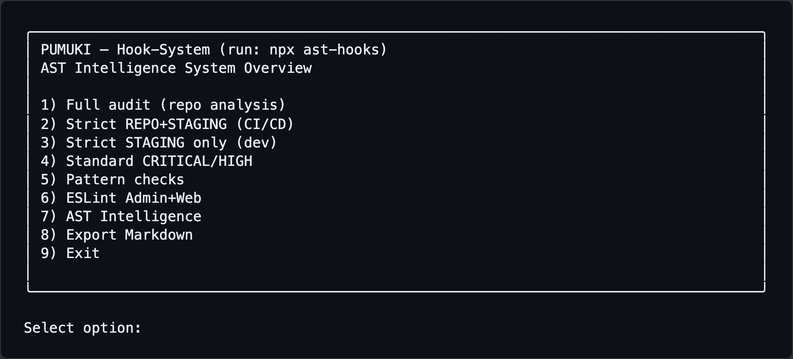
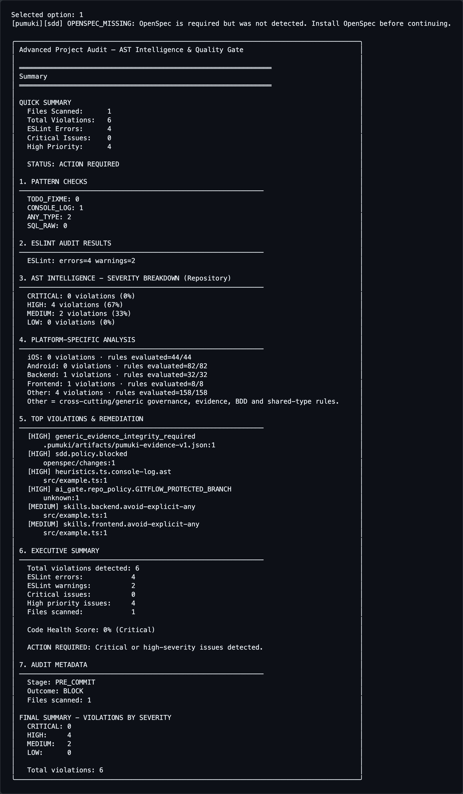
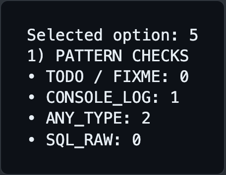

# Pumuki


[](https://www.npmjs.com/package/pumuki)
[](https://github.com/SwiftEnProfundidad/ast-intelligence-hooks/actions/workflows/ci.yml)
[](LICENSE)

Enterprise AST Intelligence and delivery gate for AI-assisted engineering teams.

Pumuki is a deterministic governance layer for Git repositories. It turns code,
repository state, skills, and SDD evidence into facts; evaluates AST-backed
rules by stage; blocks or allows work; and writes auditable evidence that humans,
hooks, CI, and agents can inspect.

```text
Git scope -> facts -> AST Intelligence rules -> gate -> .ai_evidence.json
```

## What Pumuki Does

Pumuki gives a team one enforcement model across local development, hooks, CI,
CLI, menu UI, and MCP surfaces:

| Capability | What it means in practice |
| --- | --- |
| Git hook governance | Managed `pre-commit` and `pre-push` hooks run the same policy gates used by the CLI. Managed hooks chain `pumuki-pre-write` first unless explicitly disabled with `PUMUKI_SKIP_CHAINED_PRE_WRITE=1`. |
| AST Intelligence | Rules are evaluated from extracted facts and AST/text nodes, not from a README promise. Findings include severity, rule id, stage, file, line, and remediation context. |
| Skills enforcement | iOS, Android, backend, frontend, and common governance skills are compiled into deterministic rule coverage. AUTO rules block through detectors; declarative rules remain visible as contracts and are not silently claimed as semantic enforcement. |
| Evidence contract | `.ai_evidence.json` records stage, outcome, policy metadata, rule coverage, findings, and operational hints for follow-up automation. |
| SDD/OpenSpec flow | Enterprise repos can require SDD sessions, change folders, and stage validation before writes, commits, pushes, or CI. |
| Agent-ready context | `.pumuki/adapter.json` and MCP stdio commands expose the same product truth to Codex, Claude, Cursor, Windsurf, OpenCode, and other clients without making the baseline IDE-dependent. |

## Real Output

These captures were generated from `pumuki@6.3.169` against a temporary Git
fixture containing a real TypeScript file with `any` and `console.log`. They are
not mockups.







Older menu walkthrough captures are still kept in
[`assets/readme/menu-option1/`](assets/readme/menu-option1/) and documented in
[`docs/operations/framework-menu-consumer-walkthrough.md`](docs/operations/framework-menu-consumer-walkthrough.md).

## Quick Start

Requirements:

- Node.js `>= 18`
- npm `>= 9`
- A Git repository

Install Pumuki in a consumer repository:

```bash
npm install --save-exact pumuki
npx --yes pumuki status --json
npx --yes pumuki doctor --json
npx --yes pumuki audit --stage=PRE_COMMIT --json
```

Run the local gates directly:

```bash
npx --yes pumuki-pre-write
npx --yes pumuki-pre-commit
npx --yes pumuki-pre-push
npx --yes pumuki-ci
```

Bootstrap an enterprise repo with SDD/OpenSpec and agent context:

```bash
npx --yes pumuki bootstrap --enterprise --agent=codex
npx --yes pumuki sdd session --open --change=<change-id>
npx --yes pumuki sdd validate --stage=PRE_WRITE --json
npx --yes pumuki policy reconcile --strict --apply --json
```

Install or refresh the IDE-neutral adapter contract:

```bash
npx --yes pumuki install
npx --yes pumuki adapter install --agent=codex --dry-run
npx --yes pumuki adapter install --agent=codex
```

## Stage Model

| Stage | Typical scope | Main use |
| --- | --- | --- |
| `PRE_WRITE` | Current working intent and SDD state | Stop invalid work before it becomes a commit candidate. |
| `PRE_COMMIT` | Staged diff plus required evidence | Block any staged violation before it enters history. |
| `PRE_PUSH` | Branch range and repository policy | Catch branch, range, governance, and evidence drift before sharing. |
| `CI` | CI diff range | Re-run the same policy contract outside the developer machine. |
| `audit` | Explicit repo/index/staged scope | Produce an operator-readable report without pretending it is a hook. |

Managed Git hooks run `PRE_WRITE` before `PRE_COMMIT` or `PRE_PUSH`. The opt-out
for that chaining is explicit: `PUMUKI_SKIP_CHAINED_PRE_WRITE=1`.

## Skills And Platforms

Pumuki is multi-platform by design. The default enterprise skill surface covers:

- `ios-enterprise-rules`
- `swift-concurrency`
- `swiftui-expert-skill`
- `swift-testing-expert`
- `core-data-expert`
- `android-enterprise-rules`
- `backend-enterprise-rules`
- `frontend-enterprise-rules`
- `enterprise-operating-system`

Rule coverage is intentionally explicit:

- `AUTO` means a rule has a deterministic detector or mapped heuristic.
- `DECLARATIVE` means the rule is a contract from a skill source, but it is not
  counted as semantic AST enforcement unless a detector exists.
- Unsupported or incomplete active-rule coverage can fail closed under strict
  enterprise policy, because false confidence is worse than a noisy block.

## Evidence And Adapters

Pumuki writes and reads `.ai_evidence.json` as the shared audit artifact for:

- gate outcome (`ALLOW`, `WARN`, `BLOCK`)
- stage and policy metadata
- finding counts by severity
- rule ids, file paths, line numbers, and categories
- active skill coverage
- operational hints and next actions

After `pumuki install`, the baseline is IDE-agnostic. Pumuki manages Git hooks
and writes `.pumuki/adapter.json` with canonical commands for MCP stdio and
agent clients. IDE-specific files such as `.cursor/mcp.json` remain opt-in.

## Command Map

| Command | Purpose |
| --- | --- |
| `pumuki status --json` | Fast repository, lifecycle, version, and governance snapshot. |
| `pumuki doctor --json` | Deeper diagnostics for install drift, hook state, parity, and hazards. |
| `pumuki audit --stage=<stage> --json` | Run AST/rule analysis for a selected stage or scope. |
| `pumuki install` | Install or reconcile the managed baseline in a Git repository. |
| `pumuki bootstrap --enterprise` | Bootstrap enterprise SDD, policy, adapter, and lifecycle context. |
| `pumuki sdd validate --stage=<stage>` | Validate SDD/OpenSpec policy for the stage. |
| `pumuki policy reconcile --strict --apply` | Reconcile policy state and evidence expectations. |
| `pumuki-pre-write` | Stage runner for write-time governance. |
| `pumuki-pre-commit` | Stage runner for commit-time governance. |
| `pumuki-pre-push` | Stage runner for push-time governance. |
| `pumuki-ci` | CI runner for the same enterprise gate contract. |
| `pumuki-framework` / `ast-hooks` | Interactive terminal menu for operators and maintainers. |

## What Pumuki Is Not

Pumuki is not the business product in your repository. It does not replace unit
tests, domain acceptance tests, API contracts, threat modeling, or human review.
It enforces the governance contract that the repository declares and the rules
that Pumuki can prove through facts, AST Intelligence, skills, and evidence.

It is also not IDE magic. MCP servers and adapter files give agents a canonical
way to ask for context and gate state, but Git hooks and CI remain the hard
enforcement path.

## Documentation

- [Installation](docs/product/INSTALLATION.md)
- [Usage](docs/product/USAGE.md)
- [Configuration](docs/product/CONFIGURATION.md)
- [API reference](docs/product/API_REFERENCE.md)
- [MCP servers](docs/mcp/mcp-servers-overview.md)
- [Evidence v2.1 contract](docs/mcp/ai-evidence-v2.1-contract.md)
- [Validation index](docs/validation/README.md)
- [Documentation index](docs/README.md)

## Maintainer Flow

Use this only when working in the Pumuki framework repository itself:

```bash
npm run framework:menu
PUMUKI_MENU_MODE=advanced npm run framework:menu
npm run skills:compile
npm run skills:lock:check
npm run -s validation:local-merge-bar
npm pack --dry-run
```

Before publishing, validate the local package, inspect the tarball contents, and
verify the published README through the npm package page or registry metadata.
