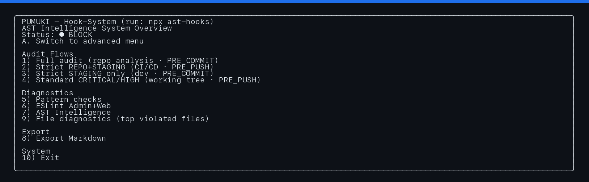
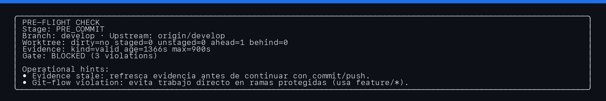
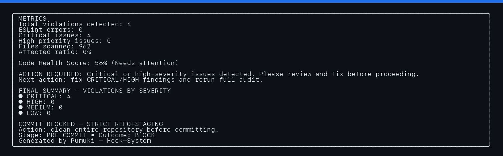
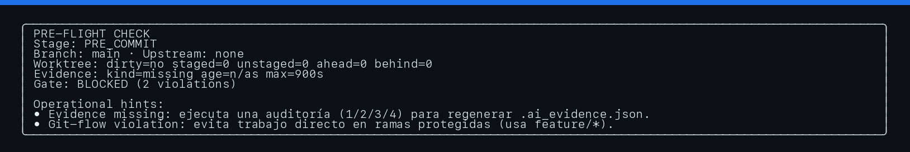
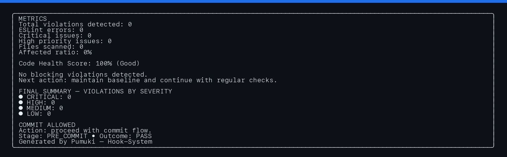

# Pumuki


[](https://www.npmjs.com/package/pumuki)
[](https://github.com/SwiftEnProfundidad/ast-intelligence-hooks/actions/workflows/ci.yml)
[](LICENSE)

Enterprise governance framework for AI-assisted software delivery.

Pumuki gives engineering teams one deterministic execution model across local development, hooks, and CI:

`Facts -> Rules -> Gate -> .ai_evidence.json (v2.1)`

## Qué NO es Pumuki

- **No** es el producto de negocio de tu repositorio (la app, el marketplace, el servicio que entregas a usuarios): es **gobernanza y contrato de entrega** sobre el código.
- **No** sustituye tests de dominio, contratos de API ni E2E: el gate ayuda a **cumplir políticas y evidencias**; la calidad funcional la define tu equipo con pruebas y criterios de aceptación.
- **No** garantiza por sí solo “un producto excelente”: sin reglas de equipo, revisión humana y criterios claros, solo obtienes **cumplimiento de lo que configuraste**.

## Who This README Is For

| Profile | Use this path first |
|---|---|
| Consumer repository team | [5-Minute Quick Start (Consumer)](#5-minute-quick-start-consumer) |
| Framework maintainers (this repo) | [Framework Maintainer Flow](#framework-maintainer-flow-this-repo) |
| Platform/architecture owners | [Enterprise Operations Baseline](#enterprise-operations-baseline) |

## Rutas de adopción

Elige un perfil y profundiza en los enlaces; **no** repite aquí reglas largas (skills, GitFlow, políticas) — están en `AGENTS.md` y en la documentación enlazada.

| Perfil | Qué instalar / arrancar | Stages habituales | Opcional típico |
|--------|-------------------------|-------------------|-----------------|
| **Mínimo** | `npm install --save-exact pumuki` (en repos Git el `postinstall` ejecuta `pumuki install --with-mcp --agent=repo` salvo `PUMUKI_POSTINSTALL_SKIP_MCP=1`). | Hooks Git: **PRE_COMMIT**, **PRE_PUSH**; cadena **PRE_WRITE** cuando el hook lo encadena (según versión y config). | Evidencia [`.ai_evidence.json` v2.1](docs/mcp/ai-evidence-v2.1-contract.md); reglas core embebidas. |
| **Estándar** | Lo anterior + flujo **OpenSpec/SDD** bajo `openspec/` según tu política. | Lo anterior + validación SDD por stage (`pumuki sdd validate --stage=…`). | Sesiones SDD, cambios versionados bajo `openspec/changes/`. |
| **Enterprise completo** | `pumuki bootstrap --enterprise` (o equivalente documentado) + `skills.lock.json` / reglas custom / [policy-as-code](docs/product/CONFIGURATION.md) donde aplique. | Lo anterior + **CI** (`pumuki-ci`) y comprobaciones de alineación (`doctor`, parity). | [Skills / MCP](docs/mcp/mcp-servers-overview.md), `pumuki doctor --parity`, notificaciones, [hard mode](docs/product/CONFIGURATION.md). |

Referencias canónicas (profundizar aquí): [Instalación](docs/product/INSTALLATION.md), [Uso y gates](docs/product/USAGE.md), [Configuración](docs/product/CONFIGURATION.md), [AGENTS.md](AGENTS.md) (contrato agentes/skills/GitFlow en repos que lo adopten), [índice de documentación](docs/README.md).

Formación opcional (curso **Pumuki** dentro del hub *Stack My Architecture*): [https://stack-my-architecture-hub.vercel.app/pumuki/](https://stack-my-architecture-hub.vercel.app/pumuki/) · seguimiento de la iniciativa en [docs/tracking/plan-curso-pumuki-stack-my-architecture.md](docs/tracking/plan-curso-pumuki-stack-my-architecture.md).

## Comandos esenciales

Cinco entradas que cubren el 80 % del día a día en un consumidor; el detalle está en los enlaces.

1. **`npx pumuki doctor --json`** — Versión efectiva, drift, lifecycle, parity y avisos (p. ej. `pathExecutionHazard`). Detalle: [API_REFERENCE](docs/product/API_REFERENCE.md), [USAGE](docs/product/USAGE.md).
2. **`npx pumuki status --json`** — Estado resumido del menú/lifecycle y alineación de versión. Detalle: [USAGE](docs/product/USAGE.md).
3. **`npx pumuki install`** (o deja que el `postinstall` lo ejecute en Git) — Hooks y lifecycle en el repo. Detalle: [INSTALLATION](docs/product/INSTALLATION.md).
4. **Gates locales** — `npx pumuki-pre-write`, `npx pumuki-pre-commit` (y `pumuki-pre-push` cuando toque push). Detalle: [USAGE](docs/product/USAGE.md), [Troubleshooting (USAGE)](docs/product/USAGE.md#troubleshooting).
5. **SDD por stage (enterprise)** — `npx pumuki sdd validate --stage=PRE_COMMIT` (u otro stage). Detalle: [USAGE](docs/product/USAGE.md), [INSTALLATION](docs/product/INSTALLATION.md#troubleshooting) si falla el bootstrap.

**Desarrollo en este repo (sin depender de GitHub Actions):** barra mínima antes de merge o publicar — `npm run -s validation:local-merge-bar` (`typecheck` + smoke de superficie CLI + `npm test`). Detalle del smoke: [docs/validation/README.md](docs/validation/README.md).

Si algo bloquea o el mensaje no es claro: [Troubleshooting](#troubleshooting) (más abajo en este README), [USAGE § Troubleshooting](docs/product/USAGE.md#troubleshooting) y [GitHub Issues](https://github.com/SwiftEnProfundidad/ast-intelligence-hooks/issues).

## 5-Minute Quick Start (Consumer)

Prerequisites:

- Node.js `>= 18`
- npm `>= 9`
- Git repository

Install and bootstrap:

```bash
npm install --save-exact pumuki
npx --yes pumuki bootstrap --enterprise --agent=codex
npx --yes pumuki status
npx --yes pumuki doctor --json
```

Desde **6.3.63**, `npm install` en la raíz de un repo **Git** dispara un `postinstall` que ejecuta **`pumuki install --with-mcp --agent=repo`** (hooks `pre-commit` / `pre-push`, lifecycle, merge de **`.pumuki/adapter.json`** con comandos MCP stdio, sin rutas de IDE salvo opt-in). **Pumuki no depende de ningún IDE** para el baseline. Opt-out del wiring MCP en postinstall: `PUMUKI_POSTINSTALL_SKIP_MCP=1`. Ficheros de IDE en postinstall: `PUMUKI_POSTINSTALL_MCP_AGENT=cursor|claude|codex` o comando manual / `bootstrap`. Desde **6.3.68**, cada hook gestionado ejecuta **`pumuki-pre-write` antes** de `pumuki-pre-commit` / `pumuki-pre-push` (stage **PRE_WRITE** vía Git). Saltar solo PRE_WRITE en hooks: `PUMUKI_SKIP_CHAINED_PRE_WRITE=1`. Desde **6.3.69**, esos mismos hooks aplican también **git-flow en ramas protegidas** (`GITFLOW_PROTECTED_BRANCH`) e **higiene de worktree** (`PUMUKI_PREWRITE_WORKTREE_*` / códigos `EVIDENCE_PREWRITE_WORKTREE_*`) cuando la evidencia es válida; el **modal macOS** de bloqueo (Desactivar / Silenciar 30 min / Mantener activas) queda **activo por defecto** si las notificaciones están habilitadas (`"blockedDialogEnabled": false` o `PUMUKI_MACOS_BLOCKED_DIALOG=0` para apagarlo). Desactivar el postinstall: `PUMUKI_SKIP_POSTINSTALL=1`. En CI suele saltarse solo (`CI=true`). En **6.3.64+**, las notificaciones del sistema en plataformas sin banner nativo se reflejan en **stderr** por defecto (`PUMUKI_DISABLE_STDERR_NOTIFICATIONS=1` para silenciarlas). En **6.3.69+**, un `gate.blocked` en macOS también deja una copia en **stderr** por defecto (`PUMUKI_DISABLE_GATE_BLOCKED_STDERR_MIRROR=1` para desactivar solo eso). Desde **6.3.70**, si **`.ai_evidence.json` está versionado** y **PRE_PUSH** no bloquea, ese archivo **no se reescribe** en el push (compatibilidad con **pre-commit** como hook de **pre-push**); para forzar escritura: `PUMUKI_PRE_PUSH_ALWAYS_WRITE_TRACKED_EVIDENCE=1`. Con modal de bloqueo activo, el panel interactivo prioriza foco/clics y se evita el banner duplicado.

Fallback (equivalent in pasos separados):

```bash
npx --yes pumuki install --with-mcp --agent=codex
npx --yes pumuki doctor --deep --json
```

OpenSpec/SDD baseline:

```bash
npx --yes pumuki sdd status
mkdir -p openspec/changes/<change-id>
npx --yes pumuki sdd session --open --change=<change-id>
npx --yes pumuki sdd validate --stage=PRE_COMMIT
```

Optional loop runner session (local, deterministic):

```bash
npx --yes pumuki loop run --objective="stabilize gate before commit" --max-attempts=3 --json
npx --yes pumuki loop list --json
```

Run local gates:

```bash
npx --yes --package pumuki@latest pumuki-pre-write
npx --yes --package pumuki@latest pumuki-pre-commit
```

Run push/CI gates (requires proper git context):

```bash
git push --set-upstream origin <branch>
npx --yes --package pumuki@latest pumuki-pre-push
npx --yes --package pumuki@latest pumuki-ci
```

Expected behavior:

- `PRE_WRITE` and `PRE_COMMIT`: should pass when SDD session is valid and rules are satisfied.
- `PRE_PUSH`: blocks if branch has no upstream tracking reference.
- `CI`: requires a valid diff range context (not `HEAD..HEAD` with ambiguous range).

Version drift quick check:

- `status --json` and `doctor --json` expose `version.effective`, `version.runtime`, `version.consumerInstalled`, `version.lifecycleInstalled`, `version.driftWarning`, `version.alignmentCommand`, `version.pathExecutionHazard`, `version.pathExecutionWarning`, and `version.pathExecutionWorkaroundCommand`.
- If `driftWarning` is not `null`, prefer the exact command already exposed in `version.alignmentCommand`.
- If `pathExecutionHazard` is `true`, avoid `npx/npm exec` for the install step and use the safe local workaround reported by Pumuki, for example:

```bash
node ./node_modules/pumuki/bin/pumuki.js install
```

## Why Pumuki

Modern teams need fast feedback with strict governance. Pumuki combines:

- Deterministic enforcement per stage (`PRE_WRITE`, `PRE_COMMIT`, `PRE_PUSH`, `CI`).
- A single evidence contract (`.ai_evidence.json`, v2.1) for auditability and automation.
- Multi-platform governance (iOS, Android, Backend, Frontend).
- Unified skills engine with deterministic precedence (`core -> repo -> custom`).
- Mandatory OpenSpec/SDD checks for enterprise change control.
- Unified CLI plus optional MCP servers for agent-driven workflows.

## Enterprise Execution Model

Each execution follows the same pipeline:

1. Facts extraction from staged/range/repo scope.
2. Rule evaluation by platform and stage policy.
3. Gate decision (`PASS`, `WARN`, `BLOCK`) with deterministic thresholds.
4. Evidence emission (`.ai_evidence.json`) with findings, metadata, and coverage telemetry.

Rules resolution order:

1. Core rules (embedded package snapshot).
2. Repo rules (`skills.lock.json`), optional.
3. Custom rules (`.pumuki/custom-rules.json`), optional.

Conflict policy:

- `custom > repo > core` (last writer wins by `ruleId`).
- Platform rules activate only for detected platforms.
- `generic/text` rules remain available as cross-platform governance guards.

Rule modes:

- `AUTO`: mapped to deterministic detectors/heuristics.
- `DECLARATIVE`: valid only when explicitly declared in lock/custom payload (no silent fallback for rules extracted from skills markdown).

## Core Capabilities

1. Deterministic stage gates with consistent exit semantics.
2. Evidence v2.1 with rules coverage enforcement and stable ordering.
3. Unified skills rules engine (core + repo + custom).
4. Unified AI gate behavior across CLI and MCP surfaces.
5. Mandatory OpenSpec/SDD policy checks.
6. Interactive menu UX (consumer + advanced modes).
7. Hard mode policy hardening (`.pumuki/hard-mode.json` + env overrides).
8. Lifecycle commands for install/update/diagnostics/teardown.
9. Provider-agnostic adapter scaffolding (`codex`, `claude`, `cursor`, `windsurf`, `opencode`).
10. Optional MCP servers for evidence and enterprise context.

## Policy-as-Code (Enterprise)

Pumuki supports a signed and versioned stage-policy contract at:

- `.pumuki/policy-as-code.json`

Minimal contract:

```json
{
  "version": "1.0",
  "source": "default",
  "expires_at": "2026-12-31T23:59:59.000Z",
  "signatures": {
    "PRE_COMMIT": "<sha256-hex>",
    "PRE_PUSH": "<sha256-hex>",
    "CI": "<sha256-hex>"
  }
}
```

Runtime behavior:

- If the contract is missing, Pumuki computes deterministic local metadata and still emits `policy_version`, `policy_signature`, and `policy_source`.
- If present, the contract is validated against active runtime policy for source/stage/signature.
- Validation states are emitted as `valid`, `invalid`, `expired`, or `unknown-source`.
- `PUMUKI_POLICY_STRICT=1` turns non-valid states into blocking findings (`governance.policy-as-code.invalid`).

Operational fallback:

- Keep strict mode disabled while bootstrapping a repo without a canonical contract.
- Enable strict mode once contract generation/signatures are part of your baseline pipeline.

## Telemetry Export (Enterprise)

Pumuki can export structured gate telemetry with a stable event schema (`telemetry_event_v1`) for SIEM/observability pipelines.

Default behavior remains unchanged: telemetry export is disabled unless explicitly configured.

Enable one or both outputs:

- `PUMUKI_TELEMETRY_JSONL_PATH`: local JSONL target (absolute or repo-relative path)
- `PUMUKI_TELEMETRY_OTEL_ENDPOINT`: OTLP HTTP logs endpoint (`/v1/logs`)
- `PUMUKI_TELEMETRY_OTEL_SERVICE_NAME`: optional OTel service name (default: `pumuki`)
- `PUMUKI_TELEMETRY_OTEL_TIMEOUT_MS`: optional OTel timeout in ms (default: `1500`)

Example:

```bash
export PUMUKI_TELEMETRY_JSONL_PATH=".pumuki/artifacts/gate-telemetry.jsonl"
export PUMUKI_TELEMETRY_OTEL_ENDPOINT="https://otel.example/v1/logs"
export PUMUKI_TELEMETRY_OTEL_SERVICE_NAME="pumuki-enterprise"
npx --yes --package pumuki@latest pumuki-pre-commit
```

Each event captures deterministic stage/outcome/policy/repo context per gate execution.

## Framework Maintainer Flow (This Repo)

Use this only when working in the Pumuki framework repository itself:

```bash
npm run framework:menu
PUMUKI_MENU_UI_V2=1 npm run framework:menu
PUMUKI_MENU_MODE=advanced npm run framework:menu
```

Skills engine operations:

```bash
npm run skills:compile
npm run skills:lock:check
npm run skills:import:custom
npm run skills:import:custom -- --source <absolute-path-to-SKILL.md> --source <second-absolute-path-to-SKILL.md>
```

Adapter scaffolding:

```bash
npx --yes pumuki adapter install --agent=codex --dry-run
npx --yes pumuki adapter install --agent=cursor
npm run adapter:install -- --agent=claude
```

Operational matrix/canary:

```bash
node --import tsx -e "const mod = await import('./scripts/framework-menu-matrix-runner-lib.ts'); const report = await mod.default.runConsumerMenuMatrix({ repoRoot: process.cwd() }); console.log(JSON.stringify(report, null, 2));"
node --import tsx -e "const mod = await import('./scripts/framework-menu-matrix-canary-lib.ts'); const report = await mod.default.runConsumerMenuCanary({ repoRoot: process.cwd() }); console.log(JSON.stringify(report, null, 2));"
```

Legacy parity report (strict comparator):

```bash
node --import tsx scripts/build-legacy-parity-report.ts --legacy=<legacy-evidence-path> --enterprise=<enterprise-evidence-path> --out=<output-path>
```

## Command Paths

Use these docs instead of treating `README.md` as the full command manual:

- Installation and bootstrap:
  - `docs/product/INSTALLATION.md`
- Daily usage, gates, menu, lifecycle, SDD and troubleshooting:
  - `docs/product/USAGE.md`
- Operator-focused short playbook:
  - `PUMUKI.md`
- Validation runbooks and framework-only diagnostics:
  - `docs/validation/README.md`

## Menu Walkthrough and Screenshots

### Capture 1 — Consumer Menu (v2)



### Capture 2 — Option 1 Pre-flight (BLOCK context)



### Capture 3 — Option 1 Final Summary (BLOCK)



### Capture 4 — Option 1 Pre-flight (PASS scenario)



### Capture 5 — Option 1 Final Summary (PASS)



### Capture 6 — Menu Status After PASS Run


Extended annotated walkthrough:

- `docs/operations/framework-menu-consumer-walkthrough.md`

## Enterprise Operations Baseline

Pumuki production SaaS operation baseline is defined in:

- `docs/operations/production-operations-policy.md`

Highlights:

- Minimum SLO/SLA targets for ingestion availability, latency, freshness, and isolation.
- Severity model (`SEV1/SEV2/SEV3`) with response and RCA expectations.
- Mandatory controls for tenant/repo isolation, auth policy, idempotency, and auditing.
- Go-live checklist and rollback requirements.

## Troubleshooting

- `OpenSpec change "<id>" not found`: ensure `openspec/changes/<id>` exists before opening session.
- `SDD_SESSION_MISSING`: open and validate session first.
- `pre-push blocked: branch has no upstream`: run `git push --set-upstream origin <branch>`.
- `Missing required argument --repo` / `--repo-path`: pass required flags for validation scripts.
- Legacy parity report usage requires `--legacy=<path>` and `--enterprise=<path>` (equals form).
- If menu v2 rendering fails, Pumuki falls back to classic UI.

## Documentation Index

- Installation: `docs/product/INSTALLATION.md`
- Usage: `docs/product/USAGE.md`
- Backlog tooling quick nav (incluye snippet terminal): `docs/product/USAGE.md#backlog-tooling`
- Backlog reasons shared module: `docs/product/USAGE.md#backlog-reasons`
- Testing: `docs/product/TESTING.md`
- API reference: `docs/product/API_REFERENCE.md`
- Architecture: `docs/product/ARCHITECTURE.md`
- Configuration: `docs/product/CONFIGURATION.md`
- Code standards: `docs/governance/CODE_STANDARDS.md`
- Branch protection: `docs/governance/BRANCH_PROTECTION_GUIDE.md`
- MCP servers: `docs/mcp/mcp-servers-overview.md`
- MCP evidence server: `docs/mcp/evidence-context-server.md`
- MCP consumption: `docs/mcp/agent-context-consumption.md`
- Evidence schema v2.1: `docs/mcp/ai-evidence-v2.1-contract.md`
- Operations policy (SLA/SLO): `docs/operations/production-operations-policy.md`
- Release notes: `docs/operations/RELEASE_NOTES.md`
- Changelog: `CHANGELOG.md`

## Collaboration

Contributions are welcome. For high-quality collaboration:

1. Read `docs/governance/CONTRIBUTING.md` and `docs/governance/CODE_STANDARDS.md`.
2. Create a dedicated branch per change.
3. Keep scope focused and include deterministic evidence when relevant.
4. Before opening a PR, run at least:
   - `npm run typecheck`
   - `npm run -s test:backlog-tooling`
   - `npm run test:operational-memory`
   - `npm run test:saas-ingestion`
5. Open a PR with clear problem statement, approach, and validation evidence.

## Support and Security

- Functional/usage issues: open a GitHub issue with reproducible steps.
- Enterprise diagnostics: include generated reports from `.audit-reports` when applicable.
- Security-sensitive findings: use GitHub Security Advisories for coordinated disclosure.

## License

MIT. See `LICENSE`.

## If Pumuki Helped You

If this project was useful for your team, please consider leaving a GitHub star:

[Star Pumuki on GitHub](https://github.com/SwiftEnProfundidad/ast-intelligence-hooks)
