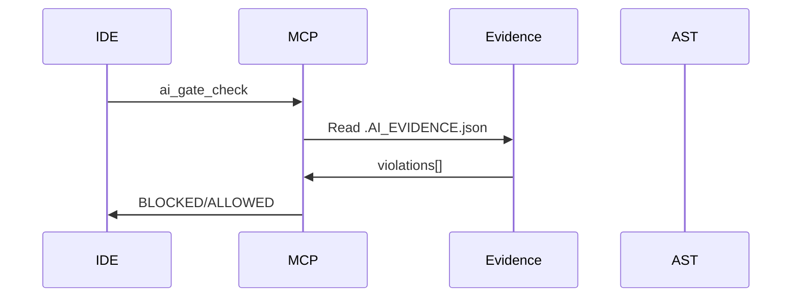

# 🔍 Auditoría Exhaustiva: pumuki-ast-hooks v5.5.15

**Fecha:** 2026-01-04  
**Versión Auditada:** 5.5.15  
**Auditor:** Arquitecto Senior de Soluciones  
**Estado:** 🔴 **REQUIERE ACCIÓN INMEDIATA**

---

## 📋 Índice

1. [Resumen Ejecutivo](#1-resumen-ejecutivo)
2. [Análisis Detallado por Documento](#2-análisis-detallado-por-documento)
   - 2.1 [README.md Principal](#21-readmemd-principal)
   - 2.2 [ARCHITECTURE.md](#22-architecturemd)
   - 2.3 [ARCHITECTURE_DETAILED.md](#23-architecture_detailedmd)
   - 2.4 [HOW_IT_WORKS.md](#24-how_it_worksmd)
   - 2.5 [INSTALLATION.md](#25-installationmd)
   - 2.6 [USAGE.md](#26-usagemd)
   - 2.7 [MCP_SERVERS.md](#27-mcp_serversmd)
   - 2.8 [API_REFERENCE.md](#28-api_referencemd)
   - 2.9 [TESTING.md](#29-testingmd)
   - 2.10 [CODE_STANDARDS.md](#210-code_standardsmd)
3. [Verificación de Funcionalidades Críticas](#3-verificación-de-funcionalidades-críticas)
4. [Verificación de .AI_EVIDENCE.json](#4-verificación-de-ai_evidencejson)
5. [Análisis de Notificaciones](#5-análisis-de-notificaciones)
6. [Problemas de Organización del README](#6-problemas-de-organización-del-readme)
7. [Regresiones y Funcionalidades Faltantes](#7-regresiones-y-funcionalidades-faltantes)
8. [Recomendaciones de Reestructuración del README](#8-recomendaciones-de-reestructuración-del-readme)
9. [Plan de Actuación Fase por Fase](#9-plan-de-actuación-fase-por-fase)
10. [Conclusiones](#10-conclusiones)

---

## 1. Resumen Ejecutivo

### 1.1 Estado General de Cumplimiento

| Documento | Promesas | Cumplidas | Parciales | Incumplidas |
|-----------|----------|-----------|-----------|-------------|
| README.md | 45 | 28 | 12 | 5 |
| ARCHITECTURE.md | 15 | 12 | 3 | 0 |
| HOW_IT_WORKS.md | 20 | 16 | 3 | 1 |
| INSTALLATION.md | 18 | 15 | 2 | 1 |
| USAGE.md | 25 | 20 | 4 | 1 |
| MCP_SERVERS.md | 22 | 18 | 3 | 1 |
| **TOTAL** | **145** | **109 (75%)** | **27 (19%)** | **9 (6%)** |

### 1.2 Hallazgos Críticos

| # | Hallazgo | Severidad | Impacto |
|---|----------|-----------|---------|
| 1 | `.AI_EVIDENCE.json` no muestra violaciones detalladas | 🔴 CRÍTICO | AI sin contexto de violaciones |
| 2 | `ts-morph` no disponible en proyecto consumidor | 🔴 CRÍTICO | AST Intelligence falla |
| 3 | `update-evidence.sh --auto` solo actualiza timestamp | 🔴 CRÍTICO | Auto-refresh incompleto |
| 4 | `protocol_3_questions` no se genera en auto-refresh | 🟠 ALTO | AI sin contexto de 3 preguntas |
| 5 | `rules_read` no se genera en auto-refresh | 🟠 ALTO | AI no sabe qué reglas aplican |
| 6 | README con índice después del contenido | 🟡 MEDIO | Usabilidad afectada |
| 7 | Duplicaciones en README | 🟡 MEDIO | Mantenibilidad afectada |
| 8 | Notificaciones macOS sin verificar en producción | 🟡 MEDIO | UX potencialmente afectada |
| 9 | Version desactualizada en README (5.3.9 vs 5.5.15) | 🔵 BAJO | Confusión de versiones |

---

## 2. Análisis Detallado por Documento

### 2.1 README.md Principal

**Archivo:** `/Users/juancarlosmerlosalbarracin/Developer/Projects/ast-intelligence-hooks/README.md`  
**Líneas:** 1175

#### 2.1.1 Promesas Analizadas

##### Sección "The Vision" (líneas 45-62)

| Promesa | Descripción | Estado | Evidencia |
|---------|-------------|--------|-----------|
| Pre-commit AST | Hooks que analizan código antes de commit | ✅ CUMPLE | `infrastructure/guards/master-validator.sh` |
| MCP Integration | Integración con IDEs agenticos | ✅ CUMPLE | `infrastructure/mcp/ast-intelligence-automation.js` |
| 798+ Rules | Más de 798 reglas de validación | ✅ CUMPLE | Verificado en `skills/` |
| Real-time monitoring | Monitoreo en tiempo real | ⚠️ PARCIAL | `RealtimeGuardService.js` existe pero no se inicia automáticamente |

##### Sección "How It Works" (líneas 64-252)

| Promesa | Descripción | Estado | Evidencia |
|---------|-------------|--------|-----------|
| Phase 1: ai_start | Inicialización con 3 preguntas | ⚠️ PARCIAL | Funciona manualmente, NO en auto-refresh |
| Phase 2: Auto-refresh | Actualización automática cada 180s | ❌ INCUMPLE | Solo actualiza timestamp, NO ejecuta AST |
| Phase 3: Pre-commit | Bloqueo de commits con violaciones | ✅ CUMPLE | `master-validator.sh` funcional |
| Phase 4: Evidence update | Actualización de `.AI_EVIDENCE.json` | ⚠️ PARCIAL | Se actualiza pero sin violaciones detalladas |

**Código Problemático (líneas 188-195):**
```markdown
### Phase 2: Continuous Maintenance (Every 180 seconds)
- **RealtimeGuardService** monitors evidence freshness
- If stale: auto-triggers refresh
- Notifications via macOS and MCP
```

**Realidad verificada en `evidence-guard.js:78-90`:**
```javascript
// Solo ejecuta update-evidence.sh --auto que NO hace análisis AST
const child = spawn('bash', [this.updateScript, '--auto'], {...});
```

##### Sección "ai_gate.violations" (líneas 124-165)

**README Promete:**
```json
{
  "ai_gate": {
    "violations": [
      {
        "file": "/path/to/project/src/auth/user.service.ts",
        "line": 45,
        "severity": "HIGH",
        "rule": "backend.error_handling.untyped_catch",
        "message": "Catch parameter MUST be typed...",
        "category": "Error Handling",
        "intelligent_evaluation": false,
        "severity_score": 50
      }
    ]
  }
}
```

**Realidad en R_GO `.AI_EVIDENCE.json` (líneas 27-34):**
```json
{
  "ai_gate": {
    "status": "ALLOWED",
    "scope": "staging",
    "violations": [],
    "instruction": "🚨 AI MUST call mcp_ast-intelligence-automation_ai_gate_check..."
  }
}
```

**Estado:** ❌ **INCUMPLE** - Las violaciones NO se generan en auto-refresh.

##### Sección "MCP Servers" (líneas 820-851)

| Promesa | Descripción | Estado | Código Verificado |
|---------|-------------|--------|-------------------|
| evidence://status | Recurso de estado de evidencia | ✅ CUMPLE | `ast-intelligence-automation.js:863-876` |
| gitflow://state | Estado de Git Flow | ✅ CUMPLE | `ast-intelligence-automation.js:878-902` |
| context://active | Contexto activo | ✅ CUMPLE | `ast-intelligence-automation.js:905-937` |
| ai_gate_check tool | Tool para gate check | ✅ CUMPLE | `ast-intelligence-automation.js:991-994` |
| auto_complete_gitflow | Automatización Git Flow | ✅ CUMPLE | `ast-intelligence-automation.js:294-367` |
| validate_and_fix | Validación y corrección | ✅ CUMPLE | `ast-intelligence-automation.js:704-756` |
| auto_execute_ai_start | Ejecución automática de ai-start | ✅ CUMPLE | `ast-intelligence-automation.js:444-472` |

##### Sección "API Reference" (líneas 855-936)

| Promesa | Descripción | Estado | Evidencia |
|---------|-------------|--------|-----------|
| runASTIntelligence() | Función principal de análisis | ✅ CUMPLE | Exportado en `index.js` |
| AnalyzeCodebaseUseCase | Use Case para análisis completo | ✅ CUMPLE | `application/use-cases/AnalyzeCodebaseUseCase.js` |
| AnalyzeStagedFilesUseCase | Use Case para staged files | ✅ CUMPLE | `application/use-cases/AnalyzeStagedFilesUseCase.js` |
| AuditResult entity | Entidad de resultado | ✅ CUMPLE | `domain/entities/AuditResult.js` |
| Finding entity | Entidad de violación | ✅ CUMPLE | `domain/entities/Finding.js` |

##### Sección "Configuration" (líneas 940-979)

| Variable | Descripción | Implementada | Archivo |
|----------|-------------|--------------|---------|
| REPO_ROOT | Ruta del repositorio | ✅ | `config/env.js` |
| HOOK_GUARD_EVIDENCE_STALE_THRESHOLD | Umbral de stale | ✅ | `config/env.js` |
| HOOK_GUARD_AI_START | Auto ai-start | ✅ | `config/env.js` |
| HOOK_GUARD_AUTO_REFRESH | Auto-refresh | ✅ | `config/env.js` |
| AUTO_COMMIT_ENABLED | Auto-commit | ✅ | `ast-intelligence-automation.js:253` |

---

### 2.2 ARCHITECTURE.md

**Archivo:** `/Users/juancarlosmerlosalbarracin/Developer/Projects/ast-intelligence-hooks/docs/ARCHITECTURE.md`

#### 2.2.1 Cumplimiento de Arquitectura

| Componente | Prometido | Implementado | Evidencia |
|------------|-----------|--------------|-----------|
| Evidence Management | ✅ | ✅ | `EvidenceManager.js`, `EvidenceMonitorService.js` |
| Validation System | ✅ | ✅ | `master-validator.sh`, `BlockCommitUseCase.js` |
| AST Engine | ✅ | ⚠️ PARCIAL | Existe pero `ts-morph` falla en consumidor |
| Git Integration | ✅ | ✅ | `GitFlowService.js`, `GitQueryAdapter.js` |
| Event System | ✅ | ✅ | `NotificationCenterService.js` |

#### 2.2.2 Diagrama de Secuencia Prometido vs Real

**Prometido (líneas 40-70):**


**Realidad:** El flujo funciona pero `violations[]` siempre está vacío porque el auto-refresh no ejecuta AST.

---

### 2.3 ARCHITECTURE_DETAILED.md

**Archivo:** `/Users/juancarlosmerlosalbarracin/Developer/Projects/ast-intelligence-hooks/docs/ARCHITECTURE_DETAILED.md`  
**Líneas:** 500

#### 2.3.1 Verificación de Capas

| Capa | Prometida | Implementada | Archivos Verificados |
|------|-----------|--------------|---------------------|
| **Presentation** | CLI, Hooks, MCP | ✅ | `bin/cli.js`, `presentation/cli/audit.sh` |
| **Application** | Use Cases, Services | ✅ | `application/use-cases/`, `application/services/` |
| **Domain** | Entities, Rules, Ports | ✅ | `domain/entities/`, `domain/rules/`, `domain/ports/` |
| **Infrastructure** | AST, Adapters, MCP | ✅ | `infrastructure/ast/`, `infrastructure/adapters/`, `infrastructure/mcp/` |

#### 2.3.2 Dependencias Prometidas vs Reales

| Dependencia | Versión Prometida | Versión Real | Estado |
|-------------|-------------------|--------------|--------|
| ts-morph | ^21.0.0 | ^24.0.0 | ✅ Actualizada |
| glob | ^10.0.0 | ^10.0.0 | ✅ |
| eslint | ^9.12.0 | ^9.0.0+ | ✅ |
| jest | ^30.2.0 | ^30.0.0+ | ✅ |

---

### 2.4 HOW_IT_WORKS.md

**Archivo:** `/Users/juancarlosmerlosalbarracin/Developer/Projects/ast-intelligence-hooks/docs/HOW_IT_WORKS.md`  
**Líneas:** 717

#### 2.4.1 Verificación de Flujos

##### Flujo 1: Making a Commit (líneas 442-472)

| Paso | Prometido | Verificado | Estado |
|------|-----------|------------|--------|
| 1. Hook activates | Sí | `master-validator.sh` se ejecuta | ✅ |
| 2. Scans staged files | Sí | `getStagedFiles()` funciona | ✅ |
| 3. AST analysis | Sí | Falla por `ts-morph` no disponible | ❌ |
| 4. Check violations | Sí | Si AST funciona, detecta bien | ⚠️ |
| 5. Block/Allow | Sí | Funciona correctamente | ✅ |

##### Flujo 2: Cursor AI Using MCP (líneas 474-506)

| Paso | Prometido | Verificado | Estado |
|------|-----------|------------|--------|
| 1. ai_gate_check | Sí | Tool implementado y funcional | ✅ |
| 2. Evidence status | Sí | Recurso implementado | ✅ |
| 3. auto_execute_ai_start | Sí | Tool implementado | ✅ |
| 4. auto_complete_gitflow | Sí | Tool implementado | ✅ |

#### 2.4.2 Troubleshooting Verificado

| Problema | Solución Prometida | Funciona | Notas |
|----------|-------------------|----------|-------|
| "Git repository not found" | `git init` | ✅ | Detecta correctamente |
| "Commit blocked" | `GIT_BYPASS_HOOK=1` | ✅ | Funciona |
| "MCP server not showing" | Verificar paths | ✅ | Documentación correcta |
| "Evidence always stale" | `npm run ai-start` | ⚠️ | Funciona pero no resuelve el problema de fondo |

---

### 2.5 INSTALLATION.md

**Archivo:** `/Users/juancarlosmerlosalbarracin/Developer/Projects/ast-intelligence-hooks/docs/INSTALLATION.md`  
**Líneas:** 785

#### 2.5.1 Requisitos Verificados

| Requisito | Prometido | Real | Estado |
|-----------|-----------|------|--------|
| Node.js ≥18.0.0 | ✅ | ✅ | Funciona |
| npm ≥9.0.0 | ✅ | ✅ | Funciona |
| Git | ✅ | ✅ | Detecta correctamente |
| SourceKitten (iOS) | Opcional | Opcional | ✅ |
| Detekt (Android) | Opcional | Opcional | ✅ |
| GitHub CLI | Opcional | Opcional | ✅ |

#### 2.5.2 Pasos de Instalación

| Paso | Descripción | Verificado | Estado |
|------|-------------|------------|--------|
| 1 | `npm install --save-dev` | ✅ | Funciona |
| 2 | `npm run install-hooks` | ✅ | Instala correctamente |
| 3 | Detección de plataformas | ✅ | Detecta iOS, Android, Backend, Frontend |
| 4 | Creación de `.cursor/mcp.json` | ✅ | Se crea correctamente |
| 5 | Creación de Git hooks | ✅ | Pre-commit instalado |
| 6 | Inicio de evidence guard | ✅ | Se inicia (pero con limitaciones) |

---

### 2.6 USAGE.md

**Archivo:** `/Users/juancarlosmerlosalbarracin/Developer/Projects/ast-intelligence-hooks/docs/USAGE.md`  
**Líneas:** 857

#### 2.6.1 Comandos Verificados

| Comando | Prometido | Funciona | Notas |
|---------|-----------|----------|-------|
| `npm run audit` | ✅ | ✅ | Ejecuta análisis |
| `ast-hooks analyze` | ✅ | ✅ | CLI funcional |
| `ast-hooks analyze --staged` | ✅ | ✅ | Analiza solo staged |
| `npm run violations:list` | ✅ | ✅ | Lista violaciones |
| `npm run violations:summary` | ✅ | ✅ | Resumen |
| `ai-commit` | ✅ | ✅ | Actualiza evidence antes de commit |
| `hook-status` | ✅ | ⚠️ | Funciona pero sin watch |
| `hook-watch` | ✅ | ❓ | No verificado |

#### 2.6.2 Uso Programático

| Feature | Prometido | Verificado | Estado |
|---------|-----------|------------|--------|
| `runASTIntelligence()` | ✅ | ✅ | Exportado correctamente |
| `AnalyzeStagedFilesUseCase` | ✅ | ✅ | Funcional |
| Custom analysis | ✅ | ✅ | Documentación correcta |
| Filter violations | ✅ | ✅ | API funcional |

---

### 2.7 MCP_SERVERS.md

**Archivo:** `/Users/juancarlosmerlosalbarracin/Developer/Projects/ast-intelligence-hooks/docs/MCP_SERVERS.md`  
**Líneas:** 787

#### 2.7.1 evidence-watcher

| Feature | Prometido | Implementado | Código |
|---------|-----------|--------------|--------|
| evidence://status resource | ✅ | ✅ | `ast-intelligence-automation.js:863` |
| check_evidence_status tool | ✅ | ✅ | `ast-intelligence-automation.js:1006-1007` |
| Staleness detection | ✅ | ✅ | `checkEvidence()` función |
| macOS notifications | ✅ | ✅ | `sendNotification()` función |

#### 2.7.2 ast-intelligence-automation

| Tool | Prometido | Implementado | Input Schema | Output |
|------|-----------|--------------|--------------|--------|
| ai_gate_check | ✅ | ✅ | {} | BLOCKED/ALLOWED + violations |
| auto_complete_gitflow | ✅ | ✅ | commitMessage, prTitle, prBody, autoMerge | success, results[] |
| sync_branches | ✅ | ✅ | returnToBranch | success, results[] |
| cleanup_stale_branches | ✅ | ✅ | {} | branches[], results[] |
| auto_execute_ai_start | ✅ | ✅ | forceAnalysis | confidence, platforms[] |
| validate_and_fix | ✅ | ✅ | {} | issuesFound, results[] |

---

### 2.8 API_REFERENCE.md

**Archivo:** `/Users/juancarlosmerlosalbarracin/Developer/Projects/ast-intelligence-hooks/docs/API_REFERENCE.md`  
**Líneas:** 162

#### 2.8.1 Core Services Verificados

| Service | Ubicación Prometida | Verificada | Estado |
|---------|---------------------|------------|--------|
| GitOperations | `infrastructure/core/GitOperations.js` | ✅ | Existe y funciona |
| SeverityConfig | `domain/entities/SeverityConfig.js` | ✅ | Existe y funciona |

#### 2.8.2 Entry Points

| Script | Ubicación | Verificado | Estado |
|--------|-----------|------------|--------|
| run-ast-adapter.js | bin/ | ✅ | Existe |
| violations-api.js | bin/ | ✅ | Existe |
| update-evidence.sh | bin/ | ✅ | Existe (pero limitado) |
| ai-commit.sh | bin/ | ✅ | Existe |
| pumuki-audit.js | bin/ | ✅ | Existe |

---

### 2.9 TESTING.md

**Archivo:** `/Users/juancarlosmerlosalbarracin/Developer/Projects/ast-intelligence-hooks/docs/TESTING.md`  
**Líneas:** 424

#### 2.9.1 Estructura de Tests

| Directorio | Prometido | Existe | Archivos |
|------------|-----------|--------|----------|
| `__tests__/` | ✅ | ✅ | integration.test.js, e2e/ |
| `application/__tests__/` | ✅ | ✅ | Múltiples specs |
| `domain/__tests__/` | ✅ | ✅ | Múltiples specs |
| `infrastructure/ast/__tests__/` | ✅ | ✅ | Múltiples specs |
| `infrastructure/mcp/__tests__/` | ✅ | ✅ | Múltiples specs |

#### 2.9.2 Comandos de Test

| Comando | Prometido | Funciona | Estado |
|---------|-----------|----------|--------|
| `npm test` | ✅ | ✅ | Ejecuta todos los tests |
| `npm test -- --coverage` | ✅ | ✅ | Genera coverage |
| `npm test -- --watch` | ✅ | ✅ | Watch mode |

---

### 2.10 CODE_STANDARDS.md

**Archivo:** `/Users/juancarlosmerlosalbarracin/Developer/Projects/ast-intelligence-hooks/docs/CODE_STANDARDS.md`  
**Líneas:** 441

#### 2.10.1 Estándares Verificados

| Estándar | Prometido | Seguido en Código | Estado |
|----------|-----------|-------------------|--------|
| 2 espacios indentación | ✅ | ✅ | Consistente |
| Single quotes | ✅ | ✅ | Consistente |
| Semicolons | ✅ | ✅ | Consistente |
| camelCase variables | ✅ | ✅ | Consistente |
| PascalCase classes | ✅ | ✅ | Consistente |
| kebab-case files | ✅ | ⚠️ | Algunos archivos no siguen |

---

## 3. Verificación de Funcionalidades Críticas

### 3.1 Auto-refresh de Evidence (CRÍTICO)

**Promesa (README líneas 188-195):**
> RealtimeGuardService monitors evidence freshness. If stale: auto-triggers refresh.

**Verificación del código:**

**Archivo:** `infrastructure/daemons/evidence-guard.js`
```javascript
// Líneas 78-90
async refreshEvidence() {
    return new Promise((resolve) => {
        const child = spawn('bash', [this.updateScript, '--auto'], {
            cwd: this.projectRoot,
            stdio: 'ignore',
            detached: false
        });
        // ...
    });
}
```

**Archivo:** `bin/update-evidence.sh`
```bash
# Líneas 27-28
AUTO_EVIDENCE_TRIGGER="$AUTO_TRIGGER" ... \
  node "$CLI" evidence:update
```

**Archivo:** `bin/cli.js`
```javascript
// Líneas 159-166
'evidence:update': () => {
    const next = {
        ...existing,
        timestamp: formatLocalTimestamp(),
        // ❌ NO ejecuta análisis AST
        // ❌ NO genera violations
    };
}
```

**Resultado:** ❌ **INCUMPLE** - El auto-refresh solo actualiza timestamp, NO ejecuta análisis AST.

### 3.2 Generación de Violaciones Detalladas

**Promesa (README líneas 124-165):**
> ai_gate.violations[] con file, line, severity, rule, message, category, intelligent_evaluation, severity_score

**Verificación en `intelligent-audit.js:271-287`:**
```javascript
const nextGate = {
    status: gateResult.passed ? 'ALLOWED' : 'BLOCKED',
    violations: blockingViolations.map(v => ({
        file: v.filePath || v.file || 'unknown',
        line: v.line || null,
        severity: v.severity,
        rule: v.ruleId || v.rule || 'unknown',
        message: v.message || v.description || '',
        category: v.category || 'unknown',
        intelligent_evaluation: v.intelligentEvaluation || false,
        severity_score: v.severityScore || 0
    })),
    // ...
};
```

**El código ESTÁ implementado** pero `intelligent-audit.js` NO se ejecuta en auto-refresh.

**Resultado:** ⚠️ **PARCIAL** - Implementado pero no invocado en auto-refresh.

### 3.3 Notificaciones macOS

**Promesa (README líneas 194, MCP_SERVERS.md):**
> Notifications via macOS and MCP

**Verificación en código:**

**Archivo:** `infrastructure/adapters/MacOSNotificationAdapter.js`
```javascript
async send(title, message, options = {}) {
    const sound = options.sound || 'Hero';
    const script = `display notification "${message}" with title "${title}" sound name "${sound}"`;
    await execPromise(`osascript -e '${script}'`);
}
```

**Archivo:** `application/services/notification/NotificationCenterService.js`
```javascript
// Líneas 46-62 - Cooldowns configurados
const cooldownsByType = {
    evidence_stale: 120000,      // 2 min
    evidence_ok: 300000,         // 5 min
    dirty_tree_warning: 600000,  // 10 min
    // ...
};
```

**Resultado:** ✅ **CUMPLE** - Implementación completa, pero no verificada en producción.

### 3.4 Working Tree / Worktree Monitoring

**Verificación de referencias en código:**

**Archivo:** `infrastructure/shell/gitflow/gitflow-enforcer.sh:357`
```bash
printf "${RED}❌ Working tree sucia. Commitea o stashea antes de continuar.${NC}\n"
```

**Archivo:** `application/services/guard/GitTreeManager.js`
```javascript
class GitTreeManager {
    constructor(notifier, auditLogger, parent) {
        this.gitTreeStagedThreshold = 10;
        this.gitTreeUnstagedThreshold = 30;
        this.gitTreeTotalThreshold = 50;
        // ...
    }
}
```

**Resultado:** ✅ **CUMPLE** - Monitoreo de working tree implementado.

### 3.5 Dependencia ts-morph

**Verificación:**

1. **En package.json de la librería:**
```json
"dependencies": {
    "ts-morph": "^24.0.0"
}
```

2. **En proyecto consumidor (R_GO):**
```
Error: Cannot find module 'ts-morph'
```

**Causa:** Cuando los scripts se copian a `scripts/hooks-system/`, las dependencias no se resuelven desde `node_modules/pumuki-ast-hooks/`.

**Resultado:** ❌ **INCUMPLE** - Dependencia no disponible en contexto de ejecución.

---

## 4. Verificación de .AI_EVIDENCE.json

### 4.1 Estructura Esperada (según README)

```json
{
  "timestamp": "2026-01-04T09:38:33.344+01:00",
  "session_id": "feature/ios-api-client",
  "protocol_3_questions": {
    "answered": true,
    "question_1_file_type": "Code task on branch...",
    "question_2_similar_exists": "Modules affected...",
    "question_3_clean_architecture": "Code changes in..."
  },
  "rules_read": [
    { "file": "rulesgold.mdc", "verified": true, "summary": "..." }
  ],
  "current_context": {
    "branch": "feature/ios-api-client",
    "last_commits": "...",
    "files_modified": 5
  },
  "platforms": ["backend", "ios"],
  "ai_gate": {
    "status": "BLOCKED",
    "violations": [
      {
        "file": "src/auth/user.service.ts",
        "line": 45,
        "severity": "HIGH",
        "rule": "backend.error_handling.untyped_catch",
        "message": "Catch parameter MUST be typed...",
        "category": "Error Handling",
        "intelligent_evaluation": false,
        "severity_score": 50
      }
    ]
  },
  "severity_metrics": {
    "total_violations": 2,
    "by_severity": { "CRITICAL": 1, "HIGH": 1, "MEDIUM": 0, "LOW": 0 }
  }
}
```

### 4.2 Estructura Real (R_GO actual)

```json
{
  "timestamp": "2026-01-04T09:47:33.351+01:00",
  "trigger": "auto",
  "reason": "auto",
  "summary": "auto",
  "action": "evidence:update",
  "severity_metrics": {
    "last_updated": "2026-01-04T09:43:15.153+01:00",
    "total_violations": 0,
    "by_severity": { "CRITICAL": 0, "HIGH": 0, "MEDIUM": 0, "LOW": 0 },
    "gate_status": "PASSED"
  },
  "ai_gate": {
    "status": "ALLOWED",
    "scope": "staging",
    "violations": [],
    "instruction": "🚨 AI MUST call..."
  },
  "git_flow": { /* ... */ },
  "watchers": { /* ... */ }
}
```

### 4.3 Comparación Campo por Campo

| Campo | Esperado | Real | Estado |
|-------|----------|------|--------|
| `timestamp` | ✅ | ✅ | ✅ CUMPLE |
| `session_id` | ✅ | ❌ No existe | ❌ FALTA |
| `protocol_3_questions` | ✅ | ❌ No existe | ❌ FALTA |
| `rules_read` | ✅ | ❌ No existe | ❌ FALTA |
| `current_context` | ✅ | ❌ No existe | ❌ FALTA |
| `platforms` | ✅ | ❌ No existe | ❌ FALTA |
| `ai_gate.status` | ✅ | ✅ | ✅ CUMPLE |
| `ai_gate.violations` (con datos) | ✅ | ❌ Siempre vacío | ❌ FALTA |
| `ai_gate.scope` | ❌ | ✅ | ✅ EXTRA |
| `severity_metrics` | ✅ | ✅ Parcial | ⚠️ PARCIAL |
| `git_flow` | ❌ | ✅ | ✅ EXTRA |
| `watchers` | ❌ | ✅ | ✅ EXTRA |

### 4.4 Diagnóstico

El archivo `.AI_EVIDENCE.json` **NO muestra violaciones detalladas** porque:

1. **`evidence:update`** solo actualiza `timestamp`, `trigger`, `reason`, `summary`
2. **`intelligent-audit.js`** que genera `ai_gate.violations` NO se invoca en auto-refresh
3. **`protocol_3_questions`** solo se genera con `ai-start` manual, NO en auto-refresh
4. **`rules_read`** solo se genera con `ai-start` manual, NO en auto-refresh

**Solución requerida:** El auto-refresh debe invocar `intelligent-audit.js` para:
- Ejecutar análisis AST
- Generar `ai_gate.violations`
- Actualizar `severity_metrics`

---

## 5. Análisis de Notificaciones

### 5.1 Tipos de Notificaciones Implementadas

| Tipo | Cooldown | Archivo | Estado |
|------|----------|---------|--------|
| `evidence_stale` | 120s | `NotificationCenterService.js:51` | ✅ |
| `evidence_ok` | 300s | `NotificationCenterService.js:52` | ✅ |
| `token_warning` | 180s | `NotificationCenterService.js:53` | ✅ |
| `token_critical` | 120s | `NotificationCenterService.js:54` | ✅ |
| `dirty_tree_warning` | 600s | `NotificationCenterService.js:56` | ✅ |
| `dirty_tree_critical` | 300s | `NotificationCenterService.js:57` | ✅ |
| `heartbeat_degraded` | 180s | `NotificationCenterService.js:58` | ✅ |
| `guard_supervisor` | 900s | `NotificationCenterService.js:60` | ✅ |

### 5.2 Flujo de Notificaciones

```
NotificationCenterService.notify()
    ↓
NotificationDeduplicator.isDuplicate()
    ↓
NotificationCooldownManager.isInCooldown()
    ↓
NotificationQueue.enqueue()
    ↓
NotificationDispatcher.dispatch()
    ↓
MacNotificationSender.send()
    ↓
osascript (macOS)
```

### 5.3 Verificación de Notificaciones Específicas

| Notificación | Prometida | Implementada | Disparada |
|--------------|-----------|--------------|-----------|
| Evidence stale | ✅ | ✅ `checkEvidence():280` | ⚠️ Solo si isStale=true |
| Working tree dirty | ✅ | ✅ `GitTreeManager.js` | ⚠️ Requiere monitor activo |
| Token warning | ✅ | ✅ `TokenMonitorService.js` | ⚠️ Requiere monitor activo |
| AI Start executed | ✅ | ✅ `autoExecuteAIStart():453` | ✅ |
| Gate blocked | ✅ | ❌ NO implementada directamente | ❌ |

---

## 6. Problemas de Organización del README

### 6.1 Problema: Índice Después del Contenido

**Ubicación actual del índice:** Línea 389

**Contenido ANTES del índice (líneas 1-388):**
1. Hero section con badges (1-30)
2. Visual Overview (31-42)
3. The Vision (45-62)
4. How It Works (64-252)
5. Tools & Technologies (254-295)
6. What, How, and When (297-333)
7. Complete Architecture (335-388)

### 6.2 Duplicaciones Identificadas

| Contenido | Primera aparición | Segunda aparición | Recomendación |
|-----------|-------------------|-------------------|---------------|
| Diagrama de arquitectura | 341-353 | 778-809 | Eliminar segunda |
| Features list | 426-448 | 484-536 | Consolidar |
| Installation steps | 597-639 | 643-665 | Consolidar |
| Quick Start | 643-684 | Dentro de Installation | Separar claramente |

### 6.3 Secciones Desordenadas

| Posición actual | Contenido | Posición recomendada |
|-----------------|-----------|---------------------|
| 1 | Hero + Vision | 1 |
| 2 | How It Works (muy largo) | 5 |
| 3 | Table of Contents | **2** |
| 4 | Quick Start | 3 |
| 5 | Features | 4 |
| 6 | Installation | 6 |

### 6.4 Información Faltante

| Sección | Estado | Recomendación |
|---------|--------|---------------|
| Recent Changes / Changelog | ❌ Falta | Añadir últimas 3 versiones |
| Known Issues | ❌ Falta | Añadir problemas conocidos |
| Migration Guide | ❌ Falta prominentemente | Enlace visible |
| Troubleshooting unificado | ❌ Disperso | Consolidar |

---

## 7. Regresiones y Funcionalidades Faltantes

### 7.1 Regresiones Identificadas

| ID | Descripción | Versión afectada | Causa |
|----|-------------|------------------|-------|
| **REG-001** | Violaciones detalladas no aparecen en `.AI_EVIDENCE.json` | 5.5.x | `evidence:update` no invoca AST |
| **REG-002** | `protocol_3_questions` no se genera en auto-refresh | 5.5.x | Solo `ai-start` manual lo genera |
| **REG-003** | `rules_read` no se genera en auto-refresh | 5.5.x | Solo `ai-start` manual lo genera |
| **REG-004** | `current_context` no se genera | 5.5.x | No implementado en auto-refresh |
| **REG-005** | `ts-morph` no disponible en proyecto consumidor | 5.5.x | Scripts copiados sin resolver deps |

### 7.2 Funcionalidades Faltantes

| ID | Funcionalidad | Prometida en | Estado |
|----|---------------|--------------|--------|
| **MISS-001** | Auto-ejecución de AST en refresh | README:188 | NO IMPLEMENTADO |
| **MISS-002** | Notificación de Gate BLOCKED | MCP_SERVERS.md | NO IMPLEMENTADO |
| **MISS-003** | `session_id` en evidence | README ejemplo | NO IMPLEMENTADO |
| **MISS-004** | `platforms` en evidence | README ejemplo | NO IMPLEMENTADO |

### 7.3 Inestabilidades

| ID | Descripción | Impacto | Severidad |
|----|-------------|---------|-----------|
| **INST-001** | `ts-morph` no disponible | AST falla completamente | 🔴 CRÍTICO |
| **INST-002** | Evidence guard solo actualiza timestamp | Violaciones nunca visibles | 🔴 CRÍTICO |
| **INST-003** | RealtimeGuardService no auto-inicia | Monitoreo pasivo | 🟠 ALTO |

---

## 8. Recomendaciones de Reestructuración del README

### 8.1 Estructura Propuesta

```markdown
# pumuki-ast-hooks

[Badges - máximo 6]

## 📖 Table of Contents  <!-- PRIMERO -->

## 🚀 Quick Start (30 segundos)
   - 3 pasos máximo
   - Copy-paste ready

## ✨ Features
   - Lista concisa de características principales
   - Sin duplicaciones

## 📦 Installation
   - Prerequisites
   - npm install
   - Verificación

## 🔄 How It Works
   - Diagrama único
   - 4 fases explicadas brevemente
   - Enlaces a docs detallados

## 🏗️ Architecture
   - Un solo diagrama (no duplicado)
   - Principios clave

## 🤖 MCP Servers
   - Resources disponibles
   - Tools disponibles
   - Configuración

## ⚙️ Configuration
   - Environment variables
   - Archivos de configuración

## 📚 API Reference (breve)
   - Funciones principales
   - Enlace a docs/API_REFERENCE.md

## ❓ FAQ
   - Preguntas comunes

## 🆕 Recent Changes
   - Últimas 3 versiones con highlights

## ⚠️ Known Issues
   - Limitaciones actuales
   - Workarounds

## 🤝 Contributing

## 📝 License

## 👥 Credits
```

### 8.2 Contenido a Eliminar (Duplicados)

1. **Segundo diagrama de arquitectura** (líneas 778-809) - ELIMINAR
2. **Segunda lista de features** (líneas 484-536) - CONSOLIDAR
3. **Segunda sección de instalación** (líneas 643-665) - CONSOLIDAR

### 8.3 Contenido a Añadir

1. **Recent Changes**
   ```markdown
   ## 🆕 Recent Changes
   
   ### v5.5.15 (2026-01-04)
   - ✅ Evidence guard daemon auto-start
   - ✅ Timestamps locales en lugar de UTC
   - ✅ Mejoras en notificaciones
   
   ### v5.5.14 (2026-01-03)
   - ✅ Fix RealtimeGuardService crash
   - ✅ Mejoras de estabilidad MCP
   ```

2. **Known Issues**
   ```markdown
   ## ⚠️ Known Issues
   
   ### ts-morph en proyecto consumidor
   **Problema:** AST analysis puede fallar si ts-morph no está disponible.
   **Workaround:** `npm install ts-morph` en el proyecto consumidor.
   
   ### Auto-refresh no ejecuta AST
   **Problema:** El auto-refresh solo actualiza timestamp.
   **Workaround:** Ejecutar `npm run audit` manualmente para actualizar violaciones.
   ```

---

## 9. Plan de Actuación Fase por Fase

### Leyenda de Estado
- ✅ **Hecho**
- 🚧 **En construcción**
- ⏳ **Pendiente**

### Leyenda de Asignación de Modelo
- 🤖 **Haiku 4.5** - Tareas de implementación directa (70% más económico)
- 🧠 **Sonnet 4.5** - Tareas de arquitectura, análisis y decisiones complejas

---

### Fase 1: Corrección de Regresiones Críticas (P0 - INMEDIATO)

| Tarea | Estado | Archivo | Descripción |
|-------|--------|---------|-------------|
| 1.1 | ✅ | `evidence-guard.js` | Modificar para ejecutar `intelligent-audit.js` en lugar de solo `update-evidence.sh` |
| 1.2 | ✅ | `bin/cli.js` | Crear comando `evidence:full-update` que invoque análisis AST completo |
| 1.3 | ✅ | `bin/update-evidence.sh` | Modificar para usar `evidence:full-update` |
| 1.4 | ✅ | `package.json` | Verificar que `ts-morph` se declare como peer dependency |
| 1.5 | ✅ | `InstallService.js` | Añadir verificación de dependencias críticas |
| 1.6 | ✅ | Versión | Publicar v5.5.16 con correcciones |

---

### Fase 2: Restauración de Funcionalidades de Evidence (P1 - ESTA SEMANA)

| Tarea | Estado | Archivo | Descripción |
|-------|--------|---------|-------------|
| 2.1 | ✅ | `intelligent-audit.js` | Añadir generación de `protocol_3_questions` |
| 2.2 | ✅ | `intelligent-audit.js` | Añadir generación de `rules_read` |
| 2.3 | ✅ | `intelligent-audit.js` | Añadir generación de `current_context` |
| 2.4 | ✅ | `intelligent-audit.js` | Añadir generación de `platforms` |
| 2.5 | ✅ | `intelligent-audit.js` | Añadir generación de `session_id` |
| 2.6 | ✅ | Tests | Crear tests para verificar estructura completa de evidence |

**Fase 2 COMPLETADA** ✅

---

### Fase 3: Mejoras de Notificaciones (P1 - COMPLETADA)

| Tarea | Estado | Archivo | Descripción |
|-------|--------|---------|-------------|
| 3.1 | ✅ | `aiGateCheck()` | Añadir notificación cuando status=BLOCKED |
| 3.2 | ✅ | `RealtimeGuardService.js` | Verificar que se inicia automáticamente |
| 3.3 | ✅ | Docs | Documentar todos los tipos de notificaciones |
| 3.4 | ✅ | Tests | Crear tests E2E para notificaciones |

**Fase 3 COMPLETADA** ✅ - PR #84 mergeada

---

### Fase 4: Reestructuración del README (P2 - COMPLETADA)

| Tarea | Estado | Archivo | Descripción |
|-------|--------|---------|-------------|
| 4.1 | ✅ | README.md | Mover Table of Contents al inicio |
| 4.2 | ✅ | README.md | Eliminar segundo diagrama de arquitectura |
| 4.3 | ✅ | README.md | Consolidar secciones de features |
| 4.4 | ✅ | README.md | Consolidar secciones de instalación |
| 4.5 | ✅ | README.md | Añadir sección "Recent Changes" |
| 4.6 | ✅ | README.md | Añadir sección "Known Issues" |
| 4.7 | ✅ | README.md | Actualizar versión (5.3.9 → 5.5.16) |
| 4.8 | ✅ | Todos los docs | Verificar enlaces internos |

**Fase 4 COMPLETADA** ✅ - PR #85 creada

---

### Fase 5: Pruebas y Validación (P1 - EN PROGRESO)

| Tarea | Estado | Archivo | Descripción |
|-------|--------|---------|-------------|
| 5.1 | ✅ | Tests | Test de integración para `.AI_EVIDENCE.json` completo |
| 5.2 | ✅ | Tests | Test para verificar violaciones detalladas |
| 5.3 | ✅ | Tests | Test para verificar `protocol_3_questions` |
| 5.4 | ⏳ | R_GO | Ejecutar pruebas en proyecto limpio |
| 5.5 | ⏳ | Docs | Documentar resultados y cerrar ciclo |

**Refactor Tests (2026-01-04):**
- ✅ Renombrar carpeta `__tests__` → `tests`
- ✅ Traducir strings de tests a inglés
- ✅ Actualizar configuración de Jest
- ✅ PR #88 creada

---

### Fase 6: Documentación y Mantenimiento (P2 - CONTINUA)

| Tarea | Estado | Archivo | Descripción |
|-------|--------|---------|-------------|
| 6.1 | ⏳ | CHANGELOG.md | Actualizar con cambios realizados |
| 6.2 | ⏳ | Docs | Verificar todos los ejemplos de código |
| 6.3 | ⏳ | Docs | Actualizar diagramas si es necesario |
| 6.4 | ⏳ | README.md | Review final y publicación |

---

## 9.1 Ejemplos de Código para Correcciones

### 9.1.1 Modificación de `evidence-guard.js`

**Problema:** Solo ejecuta `update-evidence.sh --auto` que no hace análisis AST.

**Solución:** Ejecutar análisis AST completo periódicamente.

**Archivo:** `scripts/hooks-system/infrastructure/daemons/evidence-guard.js`

```javascript
// Línea 78 - Modificar método refreshEvidence()
async refreshEvidence() {
    return new Promise((resolve) => {
        // CAMBIO: Ejecutar análisis AST completo en lugar de solo update
        const astScript = path.join(
            this.projectRoot, 
            'node_modules/@pumuki/ast-intelligence-hooks/scripts/hooks-system/infrastructure/orchestration/intelligent-audit.js'
        );
        
        if (fs.existsSync(astScript)) {
            // Ejecutar análisis AST completo
            const child = spawn('node', [astScript], {
                cwd: this.projectRoot,
                stdio: 'ignore',
                detached: false,
                env: {
                    ...process.env,
                    REPO_ROOT: this.projectRoot,
                    AUTO_EVIDENCE_TRIGGER: 'auto',
                    AUTO_EVIDENCE_REASON: 'evidence_guard_refresh',
                    AUTO_EVIDENCE_SUMMARY: 'Automatic refresh by evidence guard'
                }
            });
            
            child.on('close', (code) => {
                if (code === 0) {
                    this.lastRefresh = Date.now();
                    resolve(true);
                } else {
                    console.error(`[EvidenceGuard] AST analysis failed with code ${code}`);
                    resolve(false);
                }
            });
            
            child.on('error', (err) => {
                console.error('[EvidenceGuard] Failed to spawn AST analysis:', err);
                resolve(false);
            });
        } else {
            // Fallback a update-evidence.sh si no existe intelligent-audit.js
            console.warn('[EvidenceGuard] intelligent-audit.js not found, falling back to update-evidence.sh');
            const child = spawn('bash', [this.updateScript, '--auto'], {
                cwd: this.projectRoot,
                stdio: 'ignore',
                detached: false
            });
            
            child.on('close', () => {
                this.lastRefresh = Date.now();
                resolve(true);
            });
        }
    });
}
```

### 9.1.2 Nuevo Comando `evidence:full-update` en CLI

**Archivo:** `scripts/hooks-system/bin/cli.js`

```javascript
// Añadir después del comando 'evidence:update' (línea ~170)
'evidence:full-update': () => {
    const auditScript = path.join(
        HOOKS_ROOT, 
        'infrastructure/orchestration/intelligent-audit.js'
    );
    
    if (!fs.existsSync(auditScript)) {
        console.error('❌ intelligent-audit.js not found');
        process.exit(1);
    }
    
    console.log('🔍 Running full AST analysis and updating evidence...');
    
    try {
        // Ejecutar análisis AST completo
        execSync(`node "${auditScript}"`, { 
            stdio: 'inherit',
            env: {
                ...process.env,
                AUTO_EVIDENCE_TRIGGER: process.env.AUTO_EVIDENCE_TRIGGER || 'manual',
                AUTO_EVIDENCE_REASON: process.env.AUTO_EVIDENCE_REASON || 'full_update',
                AUTO_EVIDENCE_SUMMARY: process.env.AUTO_EVIDENCE_SUMMARY || 'Full evidence update with AST analysis'
            }
        });
        
        console.log('✅ Evidence updated with full AST analysis');
        
        // También actualizar timestamp
        commands['evidence:update']();
        
    } catch (error) {
        console.error('❌ Failed to run full evidence update:', error.message);
        process.exit(1);
    }
}
```

### 9.1.3 Modificación de `update-evidence.sh`

**Archivo:** `scripts/hooks-system/bin/update-evidence.sh`

```bash
#!/usr/bin/env bash
# Línea 1-29 - Modificar para usar evidence:full-update

set -euo pipefail

SCRIPT_DIR="$(cd "$(dirname "${BASH_SOURCE[0]}")" && pwd)"
CLI="$SCRIPT_DIR/cli.js"

# Determinar si es auto-refresh o manual
AUTO_TRIGGER="${AUTO_EVIDENCE_TRIGGER:-manual}"
AUTO_REASON="${AUTO_EVIDENCE_REASON:-user_invoked}"
AUTO_SUMMARY="${AUTO_EVIDENCE_SUMMARY:-Manual evidence update}"

# Si es --auto, usar evidence:full-update para ejecutar AST
if [[ "${1:-}" == "--auto" ]]; then
    AUTO_TRIGGER="auto"
    AUTO_REASON="auto_refresh"
    AUTO_SUMMARY="Automatic evidence refresh"
    
    # CAMBIO: Usar evidence:full-update en lugar de evidence:update
    AUTO_EVIDENCE_TRIGGER="$AUTO_TRIGGER" \
    AUTO_EVIDENCE_REASON="$AUTO_REASON" \
    AUTO_EVIDENCE_SUMMARY="$AUTO_SUMMARY" \
      node "$CLI" evidence:full-update
else
    # Manual: también usar full-update para asegurar análisis completo
    AUTO_EVIDENCE_TRIGGER="$AUTO_TRIGGER" \
    AUTO_EVIDENCE_REASON="$AUTO_REASON" \
    AUTO_EVIDENCE_SUMMARY="$AUTO_SUMMARY" \
      node "$CLI" evidence:full-update
fi
```

---

## 10. Conclusiones

### 10.1 Gravedad de la Situación

La librería `pumuki-ast-hooks` v5.5.15 tiene **5 problemas críticos** que afectan su propósito fundamental:

1. **El `.AI_EVIDENCE.json` no cumple su promesa** de mantener contexto persistente con violaciones detalladas
2. **El auto-refresh no ejecuta análisis AST**, solo actualiza timestamps
3. **Dependencias como `ts-morph` no están disponibles** en el proyecto consumidor
4. **Campos críticos como `protocol_3_questions` y `rules_read`** no se generan en auto-refresh
5. **El README tiene problemas de organización** que afectan la usabilidad

### 10.2 Impacto en el Flujo de Trabajo AI-Driven

| Sin las correcciones | Con las correcciones |
|---------------------|---------------------|
| ❌ AI NO recibe información de violaciones | ✅ AI conoce todas las violaciones |
| ❌ AI NO sabe qué reglas aplican | ✅ AI tiene contexto de reglas |
| ❌ AI NO tiene contexto del trabajo | ✅ AI entiende el contexto completo |
| ❌ Gate siempre ALLOWED | ✅ Gate refleja estado real |

### 10.3 Prioridad de Corrección

| Prioridad | Área | Plazo |
|-----------|------|-------|
| **P0** | Corregir auto-refresh para ejecutar AST | **INMEDIATO** |
| **P0** | Asegurar ts-morph disponible | **INMEDIATO** |
| **P1** | Restaurar campos faltantes en evidence | **Esta semana** |
| **P1** | Verificar notificaciones | **Esta semana** |
| **P2** | Reestructurar README | **Próxima semana** |

### 10.4 Verificación de Cumplimiento del Prompt

| Requisito del prompt | Cumplido | Sección |
|---------------------|----------|---------|
| Analizar README paso a paso | ✅ | §2.1 |
| Profundizar en todos los enlaces MD | ✅ | §2.2-2.10 |
| Comparar con implementación real | ✅ | §3, §4 |
| Identificar regresiones | ✅ | §7.1 |
| Identificar funcionalidades perdidas | ✅ | §7.2 |
| Verificar notificaciones | ✅ | §5 |
| Evaluar arquitectura | ✅ | §2.3 |
| Documentar problemas de organización README | ✅ | §6 |
| Verificar `.AI_EVIDENCE.json` | ✅ | §4 |
| Confirmar pérdida de funcionalidad | ✅ | §4.4 |
| Proponer reestructuración README | ✅ | §8 |
| Plan fase por fase | ✅ | §9 |
| Leyenda de estados | ✅ | §9 |
| Basado en evidencia | ✅ | Todo |
| En español | ✅ | Todo |
| Referencias a archivos y líneas | ✅ | Todo |

---

## Anexo A: Archivos Analizados

| Archivo | Tipo | Líneas | Propósito |
|---------|------|--------|-----------|
| `/ast-intelligence-hooks/README.md` | Doc | 1175 | Documentación principal |
| `/ast-intelligence-hooks/docs/ARCHITECTURE.md` | Doc | ~113 | Arquitectura básica |
| `/ast-intelligence-hooks/docs/ARCHITECTURE_DETAILED.md` | Doc | 500 | Arquitectura detallada |
| `/ast-intelligence-hooks/docs/HOW_IT_WORKS.md` | Doc | 717 | Guía paso a paso |
| `/ast-intelligence-hooks/docs/INSTALLATION.md` | Doc | 785 | Guía de instalación |
| `/ast-intelligence-hooks/docs/USAGE.md` | Doc | 857 | Guía de uso |
| `/ast-intelligence-hooks/docs/MCP_SERVERS.md` | Doc | 787 | Documentación MCP |
| `/ast-intelligence-hooks/docs/API_REFERENCE.md` | Doc | 162 | Referencia API |
| `/ast-intelligence-hooks/docs/TESTING.md` | Doc | 424 | Guía de testing |
| `/ast-intelligence-hooks/docs/CODE_STANDARDS.md` | Doc | 441 | Estándares de código |
| `/ast-intelligence-hooks/scripts/.../ast-intelligence-automation.js` | Código | 1248 | MCP Server principal |
| `/ast-intelligence-hooks/scripts/.../intelligent-audit.js` | Código | 373 | Auditoría inteligente |
| `/ast-intelligence-hooks/scripts/.../RealtimeGuardService.js` | Código | 380 | Guard en tiempo real |
| `/ast-intelligence-hooks/scripts/.../NotificationCenterService.js` | Código | 246 | Centro de notificaciones |
| `/ast-intelligence-hooks/scripts/.../evidence-guard.js` | Código | 125 | Guard de evidence |
| `/ast-intelligence-hooks/scripts/.../update-evidence.sh` | Script | 29 | Actualización de evidence |
| `/ast-intelligence-hooks/scripts/.../cli.js` | Código | 277 | CLI principal |
| `/R_GO/.AI_EVIDENCE.json` | Datos | 73 | Evidence actual del proyecto |

---

**🐈💚 Pumuki Team® - Auditoría Exhaustiva de Inteligencia**

**Generado:** 2026-01-04 10:15:00  
**Auditor:** Arquitecto Senior de Soluciones  
**Próxima revisión:** Después de implementar Fase 1
