# Hook System Architecture

## Table of Contents

- [High-Level Architecture](#high-level-architecture)
- [Framework Invariants](#framework-invariants)
- [Control Primitives](#control-primitives)
- [Data Flow](#data-flow)
- [Key Components](#key-components)
- [Quality Gates](#quality-gates)
- [Integrations](#integrations)

---

## Framework Invariants

These invariants are non-negotiable. If any of them is violated, the framework is considered misconfigured.

- **Evidence is the source of truth**
  `.AI_EVIDENCE.json` is the authoritative state for AI-assisted work. The framework treats chat history as untrusted.

- **Evidence freshness is mandatory**
  Actions that rely on evidence must validate freshness (SLA) and surface stale conditions explicitly.

- **AI Gate is a hard control point**
  The framework must be able to deterministically decide `ALLOWED` vs `BLOCKED` before risky actions.

- **Governance is Git-native**
  Enforcement happens as early as possible (pre-commit / pre-push) to prevent invalid states from reaching CI/CD.

- **Dependencies must point inward**
  Presentation and Infrastructure may depend on Domain and Application, but never the opposite.

---

## Control Primitives

Pumuki is a governance framework built around two primitives:

### 1) AI Evidence (`.AI_EVIDENCE.json`)

Responsibilities:

- Persist project state for long-running work (multi-day, multi-chat)
- Store severity metrics, platform detection, session metadata, and workflow state
- Provide a stable input for AI clients and automation tools

Failure-mode expectations:

- If evidence cannot be read or parsed, the framework should fail safe (treat as missing) and emit a diagnosable signal (logs / guard debug log).

### 2) AI Gate (Allow/Block)

Responsibilities:

- Provide deterministic control over AI-assisted actions
- Encode mandatory rules (by platform/scope)
- Enforce blocking thresholds (typically `CRITICAL`/`HIGH`)

Failure-mode expectations:

- If gate state cannot be loaded, the framework should fail safe and avoid proceeding with protected operations.

---

## High-Level Architecture

The system follows **strict Clean Architecture** with 4 well-defined layers:

```mermaid
graph TB
    subgraph Presentation["🎨 PRESENTATION LAYER"]
        CLI[CLI Interface<br/>bin/cli.js, bin/*.sh]
        Hooks[Git Hooks<br/>pre-commit, post-commit]
        MCP[MCP Servers<br/>ast-intelligence-automation]
    end

    subgraph Application["⚙️ APPLICATION LAYER"]
        UseCases[Use Cases<br/>AnalyzeCodebaseUseCase<br/>AnalyzeStagedFilesUseCase<br/>GenerateAuditReportUseCase<br/>BlockCommitUseCase]
        Services[Services<br/>ContextDetectionEngine<br/>AutonomousOrchestrator<br/>PlatformDetectionService]
    end

    subgraph Domain["🏛️ DOMAIN LAYER"]
        Entities[Entities<br/>Finding<br/>AuditResult<br/>SeverityConfig]
        Rules[Business Rules<br/>CommitBlockingRules]
        Repos[Repository Interfaces<br/>IFindingsRepository]
    end

    subgraph Infrastructure["🔧 INFRASTRUCTURE LAYER"]
        AST[AST Analyzers<br/>ast-backend.js<br/>ast-frontend.js<br/>ast-ios.js<br/>ast-android.js]
        Adapters[Adapters<br/>GitOperations<br/>FileFindingsRepository]
        Reporting[Reporting<br/>ReportGenerator<br/>SeverityTracker]
        Guards[Guards<br/>master-validator.sh<br/>guard-autostart.sh]
    end

    Presentation --> Application
    Application --> Domain
    Infrastructure --> Domain
    Application --> Infrastructure

    style Presentation fill:#e1f5ff
    style Application fill:#fff4e1
    style Domain fill:#ffe1f5
    style Infrastructure fill:#e1ffe1
```

### Dependency Principles

- ✅ **Dependencies inward**: Presentation → Application → Domain
- ✅ **Domain without dependencies**: Zero external dependencies
- ✅ **Infrastructure implements Domain**: Repositories, adapters
- ✅ **Dependency Inversion**: Interfaces in Domain, implementations in Infrastructure

---

## Data Flow

### Complete Flow: Git Commit → Analysis → Report

## Key Components

### Core Services

- **GitOperations**: Centralized Git operations
- **SeverityConfig**: Severity mapping and utilities
- **ReportGenerator**: Violation report generation and formatting
- **SeverityTracker**: Trend analysis and metrics

### AST Intelligence Pipeline

**Pipeline Steps:**

1. **AST Analysis**: Parse code and extract violations
2. **Severity Evaluation**: Apply intelligent severity evaluation
3. **Gate Policies**: Apply quality gates (CRITICAL/HIGH block)
4. **Reporting**: Generate detailed reports and metrics
5. **Evidence Update**: Update .AI_EVIDENCE.json with results

### Integration Points

- **Pre-commit Hook**: Automatic validation on `git commit`
- **CI/CD**: Quality gates in pipeline
- **IDE**: Real-time feedback via MCP server
- **CLI**: Manual auditing and debugging tools

### Platform-specific Analysis

The system analyzes code across multiple platforms:

## Quality Gates

### Blocking Gates (Exit Code 1)

The following violations **automatically block the commit**:

- 🚨 **CRITICAL severity**: Critical violations affecting security or stability
- ⚠️ **HIGH severity**: Important violations affecting quality or architecture
- 🔒 **Security violations**: Security issues (unhashed passwords, etc.)
- 🏗️ **Architecture violations**: Clean Architecture violations

### Warning Gates (Exit Code 0, Logged)

The following violations **allow the commit but generate warnings**:

- 📝 **MEDIUM severity**: Recommended improvements
- 💡 **LOW severity**: Minor suggestions
- 🎨 **Style violations**: Code style issues
- 📚 **Documentation issues**: Missing documentation

### Quality Gates Flow

```mermaid
flowchart TD
    Start[Analysis Complete] --> Check{Check<br/>Violations}
    
    Check -->|CRITICAL| Block1[🚨 Block Commit]
    Check -->|HIGH| Block2[⚠️ Block Commit]
    Check -->|MEDIUM| Warn1[📝 Warning + Allow]
    Check -->|LOW| Warn2[💡 Warning + Allow]
    Check -->|None| Allow[✅ Allow Commit]
    
    Block1 --> Report[Generate Report]
    Block2 --> Report
    Warn1 --> Log[Log Warning]
    Warn2 --> Log
    Allow --> Success[Commit Successful]
    
    Report --> Exit1[Exit Code 1]
    Log --> Exit0[Exit Code 0]
    Success --> Exit0
```

### Intelligence Features

- **Context Awareness**: Analyzes only staged files
- **Severity Intelligence**: Updates severity based on impact
- **Token Monitoring**: Monitors AI usage and alerts on thresholds
- **Trend Analysis**: Historical violation tracking

---

## Integrations

Pumuki is designed to integrate into existing enterprise workflows without requiring changes to product code.

- **Git hooks**: pre-commit / pre-push enforcement
- **CI/CD**: run audits in pipelines to enforce the same gates as local development
- **IDE / agentic clients**: MCP servers for evidence, gate checks, and automation
- **Local developer tools**: CLI entrypoints for manual audits, troubleshooting, and operational flows

---

## References

For more details on the architecture:

- 📚 [ARCHITECTURE_DETAILED.md](./ARCHITECTURE_DETAILED.md) - Detailed architecture with complete diagrams
- 📖 [API_REFERENCE.md](./API_REFERENCE.md) - API reference
- 🔌 [MCP_SERVERS.md](./MCP_SERVERS.md) - MCP integration

---

**Last updated**: 2025-01-13  
**Version**: 5.3.0  
🐈💚 **Pumuki Team®** - Hook System Architecture
