# Detailed Architecture - ast-intelligence-hooks

## Table of Contents

1. [Overview](#overview)
2. [Layer Architecture](#layer-architecture)
3. [Data Flow](#data-flow)
4. [Modules and Dependencies](#modules-and-dependencies)
5. [Extension Points](#extension-points)
6. [Key Files Mapping](#key-files-mapping)

---

## Overview

`ast-intelligence-hooks` is an intelligent static analysis system that applies strict Clean Architecture to ensure code quality, architectural compliance, and Git Flow automation.

### Key Features

- **Multi-platform**: iOS (Swift), Android (Kotlin), Backend (TypeScript/NestJS), Frontend (React/Next.js)
- **Layered Architecture**: Domain → Application → Infrastructure → Presentation
- **798+ Rules**: Automatic validation of architectural and code patterns
- **MCP Integration**: Model Context Protocol for integration with Cursor AI
- **Git Hooks**: Automatic pre-commit hooks for validation at commit time

---

## Layer Architecture

```mermaid
graph TB
    subgraph Presentation["🎨 PRESENTATION LAYER"]
        CLI[CLI Commands<br/>bin/*.js, bin/*.sh]
        Hooks[Git Hooks<br/>pre-commit, post-commit]
        MCP[MCP Servers<br/>ast-intelligence-automation]
    end

    subgraph Application["⚙️ APPLICATION LAYER"]
        UseCases[Use Cases<br/>AnalyzeCodebaseUseCase<br/>AnalyzeStagedFilesUseCase<br/>GenerateAuditReportUseCase<br/>BlockCommitUseCase]
        Services[Services<br/>ContextDetectionEngine<br/>AutonomousOrchestrator<br/>PlatformDetectionService]
    end

    subgraph Domain["🏛️ DOMAIN LAYER"]
        Entities[Entities<br/>Finding<br/>AuditResult<br/>SeverityConfig]
        Rules[Business Rules<br/>CommitBlockingRules]
        Repos[Repository Interfaces<br/>IFindingsRepository]
    end

    subgraph Infrastructure["🔧 INFRASTRUCTURE LAYER"]
        AST[AST Analyzers<br/>ast-backend.js<br/>ast-frontend.js<br/>ast-ios.js<br/>ast-android.js]
        Adapters[Adapters<br/>GitOperations<br/>FileFindingsRepository]
        Reporting[Reporting<br/>ReportGenerator<br/>SeverityTracker]
        Guards[Guards<br/>master-validator.sh<br/>guard-autostart.sh]
    end

    Presentation --> Application
    Application --> Domain
    Infrastructure --> Domain
    Application --> Infrastructure

    style Presentation fill:#e1f5ff
    style Application fill:#fff4e1
    style Domain fill:#ffe1f5
    style Infrastructure fill:#e1ffe1
```



### Dependency Principles

- **Dependencies inward**: Presentation → Application → Domain
- **Domain without dependencies**: Zero external dependencies
- **Infrastructure implements Domain**: Repositories, adapters
- **Dependency Inversion**: Interfaces in Domain, implementations in Infrastructure

---

## Data Flow

### Complete Flow: Git Commit → Analysis → Report


### Platform-specific AST Analysis Flow


---

## Modules and Dependencies

### Main Modules Diagram


### Package-Level Dependencies


---

## Extension Points

### 1. Add New Analysis Rules

**Location**: `infrastructure/ast/{platform}/ast-{platform}.js`

```javascript
// Example: Add custom rule in ast-backend.js
function analyzeCustomPattern(sourceFile) {
  const violations = [];
  // Your analysis logic
  return violations;
}
```

### 2. Create New Use Cases

**Location**: `application/use-cases/`

```javascript
class CustomUseCase {
  constructor(findingsRepository, customService) {
    this.findingsRepository = findingsRepository;
    this.customService = customService;
  }
  
  async execute(params) {
    // Implementation
  }
}
```

### 3. Add New MCPs

**Location**: `infrastructure/mcp/`

Follow the pattern of `gitflow-automation-watcher.js`:

```javascript
class CustomMCPServer {
  // Implement MCP protocol
  // Expose resources and tools
}
```

### 4. Integrate New Platforms

1. Create `infrastructure/ast/{platform}/ast-{platform}.js`
2. Implement `run{Platform}Intelligence(files, config)` function
3. Add detection in `PlatformDetectionService`
4. Export in `index.js`

### 5. Customize Quality Gates

**Location**: `domain/rules/CommitBlockingRules.js`

Modify blocking rules in the `CommitBlockingRules` class:

```javascript
shouldBlockCommit(auditResult) {
  // Your custom logic
}
```

---

## Key Files Mapping

### Directory Structure

```
ast-intelligence-hooks/
├── domain/                    # 🏛️ DOMAIN LAYER
│   ├── entities/             # Business entities
│   │   ├── Finding.js        # Individual violation
│   │   ├── AuditResult.js    # Aggregated result
│   │   └── SeverityConfig.js # Severity configuration
│   ├── rules/                # Business rules
│   │   └── CommitBlockingRules.js
│   └── repositories/         # Interfaces
│       └── IFindingsRepository.js
│
├── application/               # ⚙️ APPLICATION LAYER
│   ├── use-cases/            # Use cases
│   │   ├── AnalyzeCodebaseUseCase.js
│   │   ├── AnalyzeStagedFilesUseCase.js
│   │   ├── GenerateAuditReportUseCase.js
│   │   └── BlockCommitUseCase.js
│   ├── services/             # Application services
│   │   ├── ContextDetectionEngine.js
│   │   ├── AutonomousOrchestrator.js
│   │   └── PlatformDetectionService.js
│   └── CompositionRoot.js    # Dependency injection
│
├── infrastructure/            # 🔧 INFRASTRUCTURE LAYER
│   ├── ast/                  # AST analyzers
│   │   ├── ast-intelligence.js      # Main orchestrator
│   │   ├── backend/ast-backend.js   # 150+ NestJS rules
│   │   ├── frontend/ast-frontend.js # 200+ React/Next.js rules
│   │   ├── ios/ast-ios.js           # 150+ Swift/SwiftUI rules
│   │   ├── android/ast-android.js   # 200+ Kotlin/Compose rules
│   │   └── common/ast-common.js     # 98+ general rules
│   ├── repositories/         # Implementations
│   │   └── FileFindingsRepository.js
│   ├── adapters/             # External adapters
│   │   ├── GitOperations.js
│   │   └── MacOSNotificationAdapter.js
│   ├── mcp/                  # MCP Servers
│   │   ├── gitflow-automation-watcher.js
│   │   └── evidence-watcher.js
│   ├── reporting/            # Report generation
│   │   ├── ReportGenerator.js
│   │   └── SeverityTracker.js
│   └── guards/               # Guard scripts
│       ├── master-validator.sh
│       └── guard-autostart.sh
│
├── presentation/              # 🎨 PRESENTATION LAYER
│   └── cli/                  # CLI interface
│       └── audit.sh
│
├── bin/                      # Executable binaries
│   ├── cli.js                # Main CLI
│   ├── audit                 # Audit command
│   ├── install.js            # Hooks installer
│   └── violations-api.js     # Violations API
│
├── hooks/                    # Git hooks
│   ├── pre-tool-use-guard.ts # Pre-commit guard
│   └── index.js
│
├── skills/                   # Platform-specific rules
│   ├── backend-guidelines/
│   ├── frontend-guidelines/
│   ├── ios-guidelines/
│   └── android-guidelines/
│
├── config/                   # Configurations
│   ├── ast-exclusions.json
│   ├── detect-secrets-baseline.json
│   └── language-guard.json
│
└── index.js                  # Main entry point
```

### Responsibilities by Layer

#### Domain Layer
- **Entities**: Immutable business models
- **Rules**: Pure business logic (quality gates, blocking rules)
- **Repository Interfaces**: Contracts for persistence

#### Application Layer
- **Use Cases**: Orchestration of business operations
- **Services**: Cross-cutting services (context detection, orchestration)
- **CompositionRoot**: Dependency configuration

#### Infrastructure Layer
- **AST Analyzers**: Platform-specific static analysis
- **Repositories**: Persistence implementation
- **Adapters**: Integration with external systems (Git, OS)
- **MCP Servers**: Model Context Protocol
- **Reporting**: Report and metrics generation

#### Presentation Layer
- **CLI**: Command-line interface
- **Git Hooks**: Git integration
- **MCP Interface**: Cursor AI integration

---

## Detailed Execution Flow

### 1. Initial Installation

```mermaid
sequenceDiagram
    participant User
    participant Install as bin/install.js
    participant Git as .git/hooks
    participant Config as config/

    User->>Install: npm run install-hooks
    Install->>Git: Create pre-commit hook
    Install->>Config: Generate initial configurations
    Install->>User: ✅ Hooks installed
```



### 2. Analysis Execution


### 3. Report Generation


---

## Architectural Decisions

### 1. Strict Clean Architecture

**Decision**: Separate into 4 layers with unidirectional dependencies inward.

**Reason**: Enables independent testing, maintainability and evolution without coupling.

**Alternatives considered**: Traditional MVC, Hexagonal Architecture.

### 2. Explicit Use Cases

**Decision**: Each business operation is an independent Use Case.

**Reason**: Clarity of intention, testability, single responsibility.

### 3. Platform-specific AST Analysis

**Decision**: Separate analyzers per platform (backend, frontend, ios, android).

**Reason**: Each platform has specific patterns and rules, enables independent evolution.

### 4. MCP Protocol for Integration

**Decision**: Use Model Context Protocol for integration with Cursor AI.

**Reason**: Standard protocol, enables extension without modifying core code.

### 5. Evidence-based AI Context

**Decision**: `.AI_EVIDENCE.json` as source of truth for AI context.

**Reason**: Allows AI to understand project state without analyzing all code on each request.

---

## Extension Points Summary

| Extension | Location | Complexity | Example |
|-----------|----------|------------|---------|
| New AST rule | `infrastructure/ast/{platform}/` | Low | Add analysis function |
| New Use Case | `application/use-cases/` | Medium | Implement UseCase class |
| New platform | `infrastructure/ast/{platform}/` | High | Create complete analyzer |
| New MCP Server | `infrastructure/mcp/` | Medium | Implement MCP protocol |
| Custom Quality Gate | `domain/rules/CommitBlockingRules.js` | Low | Modify shouldBlockCommit method |
| New Report Format | `infrastructure/reporting/` | Medium | Create new formatter |

---

## References

- [ARCHITECTURE.md](./ARCHITECTURE.md) - Basic architecture
- [API_REFERENCE.md](./API_REFERENCE.md) - API reference

---

**Last updated**: 2025-01-13  
**Version**: 5.3.0
